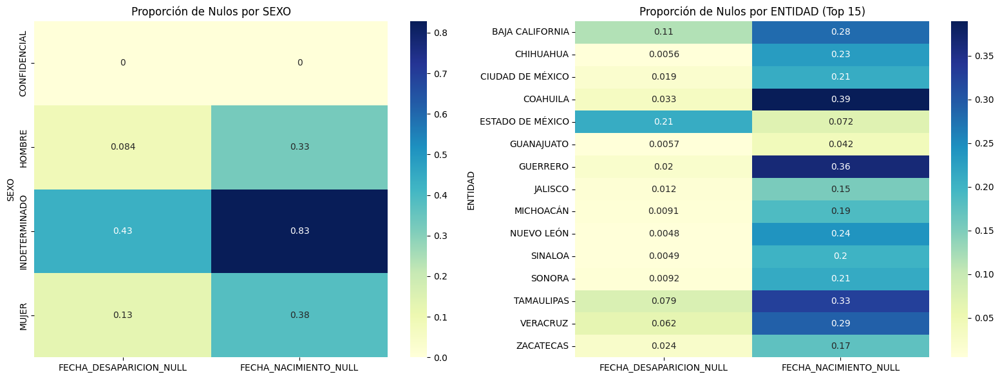
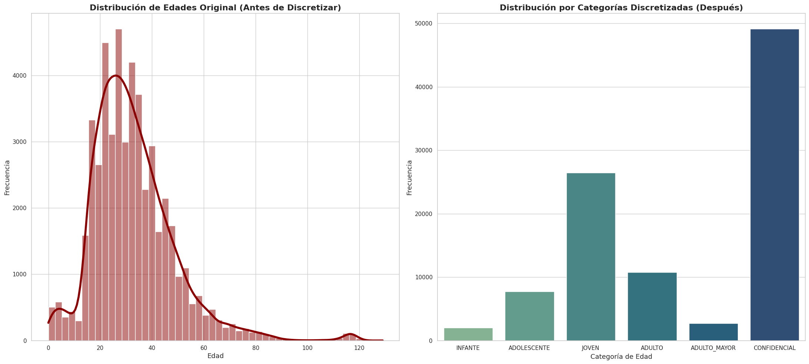
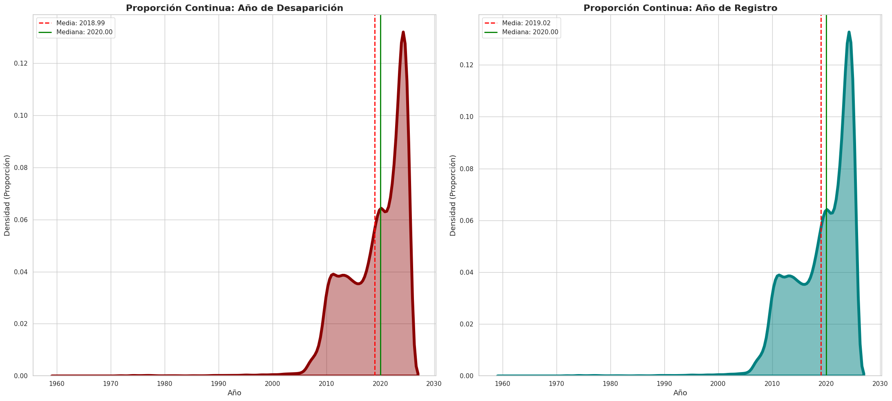
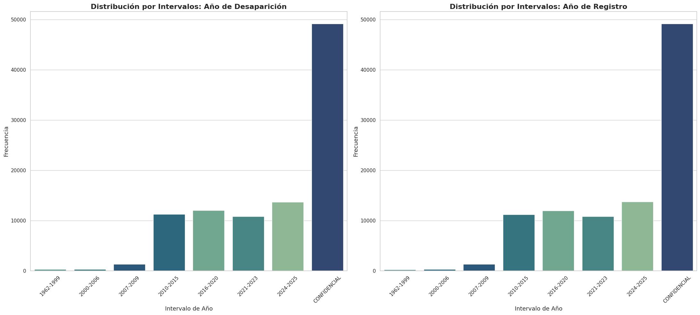
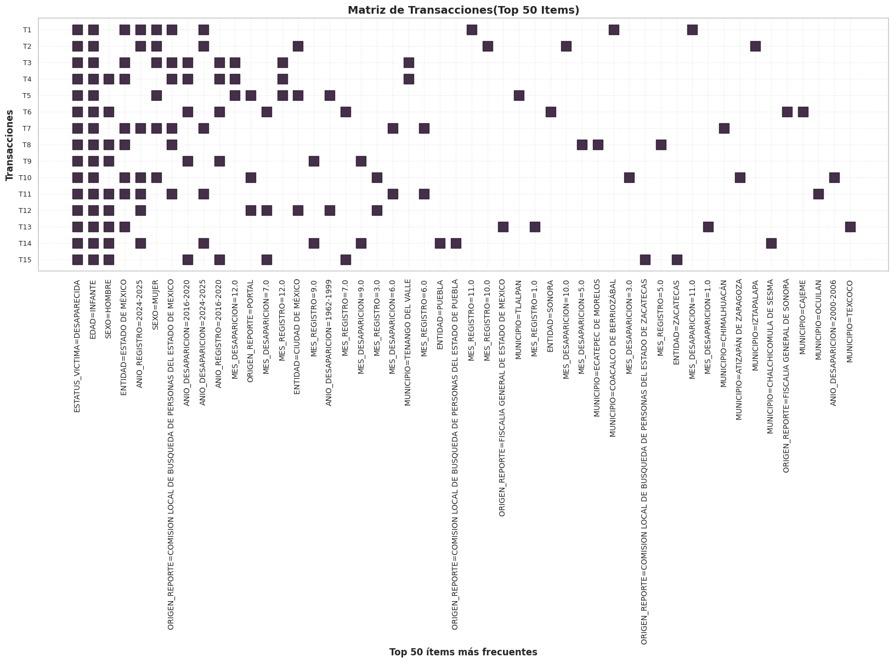
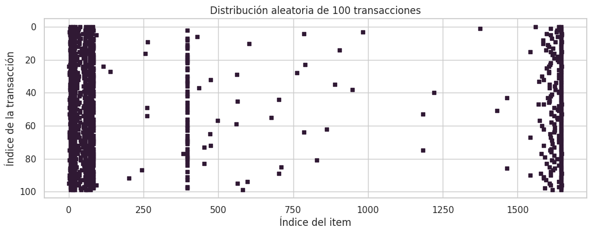

# Introducción

## Contexto del problema

Los derechos humanos buscan asegurar la dignidad de las personas, su propósito radica en salvaguardar y garantizar el bien común sin discriminar por raza, sexo, religión, edad, ideologías, entre otros aspectos. Asimismo, el reconocimiento de los derechos humanos a partir de 1948 (proclamados en la Declaración Universal de los Derechos Humanos por la ONU) señala derechos inherentes a los individuos por el hecho de ser humanos, proporcionando una protección a no sufrir tratos crueles, inhumanos o degradantes.

La desaparición de personas es un problema de seguridad y justicia, es un fenómeno que viola la dignidad del ser humano, la cual se basa en el reconocimiento de la libertad e igualdad en sus derechos. Esta privación de libertad atenta contra los derechos humanos de las personas, afecta a las víctimas y a sus familias, sembrando miedo e incertidumbre en la sociedad.

México es un país que alberga tradiciones y costumbres inigualables, sin embargo, no está exento de ser afectado por la violencia. Los índices de violencia han incrementado con el tiempo y se ha normalizado este fenómeno provocando falta de empatía y solidaridad en la sociedad, evidenciando la desigualdad. Con esto, la desaparición de personas en México ha experimentado un aumento constante y alarmante, generando una profunda crisis de derechos humanos.

Como continuación del análisis anterior sobre conjuntos de datos de los registros de estas desapariciones, en el presente trabajo buscamos continuar aplicando técnicas de minería de datos para encontrar reglas de asociación y construir modelos de clasificación que nos ayuden a encontrar nuevos patrones e información que aporte nuevas perspectivas de esta problemática.

Además, en el desarrollo de este trabajo reconocemos la importancia de este tema que nos incumbe a todos como humanidad, es un tema que ha sembrado desesperanza no sólo en México, sino en varias partes del mundo, es por ello que lo debemos tratar con la delicadeza y detalle que merece.

## Objetivos

Aplicar técnicas fundamentales de minería de datos (específicamente el descubrimiento de reglas de asociación y la construcción de modelos de clasificación) sobre un conjunto de datos real y limpio de personas desaparecidas. El propósito central es extraer patrones subyacentes e implementar predicciones automatizadas, evaluando críticamente tanto el rendimiento técnico de los algoritmos como las implicaciones del mundo real y los posibles sesgos presentes en el sistema de registro.

## Descripción del dataset

Para cumplir con los objetivos del presente trabajo contamos con un archivo que contiene información de los registros de personas desaparecidas en México. En total hay **133,887 registros** (que pueden contener campos vacíos), para cada uno de ellos hay 11 variables (características de cada registro).

Los campos con los que cuenta cada registro son los siguientes:

| Nombre de columna | Descripción | Tipo de dato | Datos no nulos |
|:--- |:--- |:---: |:---:|
| id_victima | Identificador único alfanumérico asignado a cada registro. Variable cualitativa nominal. | string | 133,887 |
| origen_reporte | Institución, fiscalía o comisión de búsqueda que emite o registra el caso. Variable cualitativa nominal. | string | 133,887 |
| fecha_nacimiento | Día, mes y año en el que nació la persona. Variable cualitativa. | datetime | 105,000 |
| sexo | Género de la víctima: HOMBRE o MUJER. Variable cualitativa nominal. | string | 133,887 |
| fecha_desaparicion | Fecha y hora del último avistamiento o reporte. Variable cualitativa. | datetime | 125,727 |
| fecha_registro | Fecha y hora de ingreso formal al sistema. Variable cualitativa. | datetime | 127,790 |
| estatus_victima | Condición actual de la persona en el sistema. Variable cualitativa nominal. | string | 133,887 |
| cve_ent | Clave numérica oficial de la Entidad Federativa (INEGI). Variable cualitativa. | int64 | 133,887 |
| entidad | Nombre del Estado de la República Mexicana. Variable cualitativa. | string | 133,887 |
| cve_mun | Clave numérica oficial del Municipio (INEGI). Variable cualitativa. | int64 | 133,887 |
| municipio | Nombre del municipio o alcaldía. Variable cualitativa. | string | 133,887 |

: Diccionario de datos del registro de víctimas {#tbl-descripciondataset tbl-colwidths="[20,50,15,15]"}

Con esta información podemos ver que en varios campos (id_victima, origen_reporte, sexo, estatus_victima, cve_ent, entidad, cve_mun, municipio) se cuenta con los registros completos, sin embargo, al observar los datos se identifico que muchos están completados con: CONFIDENCIAL, por lo que debemos considerar esto al realizar nuestros análisis.

# Algoritmo Apriori

## Descripción

Este algoritmo es un método en el análisis de datos para encontrar grupos de elementos que suelen aparecer juntos en grandes conjuntos de datos. Es esencial en el descubrimiento de patrones o reglas útiles sobre cómo se relacionan los elementos.

Los pasos claves que implementaremos en este algoritmo son:

1. **Identificación de conjuntos de elementos frecuentes:** Se examinan todos los datos para contar las apariciones de elementos y se usa el soporte mínimo para determinar si el conjunto es frecuente o no. 

2. **Creación de un posible grupo de elementos:** Tras identificar los elementos individuales que cumplieron con el soporte mínimo se combinan dichos conjuntos para crear pares y luego conjuntos de 3 y así sucesivamente hasta que no se puedan encontrar conjuntos más grandes.

3. **Eliminación de grupos de artículos poco frecuentes:** si un grupo de elementos no aparece con la suficiente frecuencia, entonces cualquier grupo más grande que incluya estos elementos tampoco aparecerá con frecuencia. 

4. **Generación de reglas de asociación:** Se comprueban las reglas utilizando el soporte, la confianza y el lift para identificar las más fuertes.

Para la implementación en Python de este algoritmo se crearon las siguientes funciones auxiliares:

* *obtener_itemsets_frecuentes_1(transacciones, soporte_min_conteo)*
    * Está función nos ayuda a generar todos los itemsets frecuentes de tamaño 1, sólo devuelve aquellos que son considerados frecuentes, es decir, los que cumplen con el soporte mínimo. Esto nos ayuda en el primer paso del algoritmo.

* *generar_candidatos(itemsets_frecuentes, k)*
    * Está función nos ayuda con el segundo paso de nuestro algoritmo, por lo que genera itemsets de tamaño k que pueden ser o no frecuentes, sólo genera las combinaciones a partir de la iteración anterior.

* *filtrar_candidatos(transacciones, candidatos, soporte_min_conteo)*
    * Con esta función nos aseguramos de quedarnos únicamente los itemsets generados anteriormente que cumplan con el soporte mínimo establecido. Esto asegura nuestro tercer paso de eliminación de grupos poco frecuentes.

Estas funciones nos dan la pauta para la implementación completa del algoritmo apriori, el cual devuelve todos los itemsets generados. Para generar las reglas usamos otra función que recibe lo que devuelve nuestro algoritmo apriori:

* *generar_reglas(itemsets_frecuentes, confianza_min)*
    * Encuentra las reglas lógicas a partir de los itemsets recibidos y consiferando el mínimo de confianza establecido.

## Python

A continuación se presenta la implementación completa en Python:

```{python}
#| eval: false
import pandas as pd
from itertools import combinations


def obtener_itemsets_frecuentes_1(transacciones, soporte_min_conteo):
    """
    Escanea toda la base de datos para contar cuántas veces aparece cada elemento individualmente. 
    Luego, descarta los que no alcanzan el umbral mínimo.

    Args:
        transacciones (list): Lista de listas. Cada lista representa un registro con sus características
        soporte_min_conteo (int): Número de veces que debe aparecer un elemento para considerarlo frecuenta

    Returns:
        dict: Diccionario donde las claves son los elementos frecuentes encapsulados en un frozenset 
              y los valores son su conteo exacto
    """
    conteo = {}
    for transaccion in transacciones:
        for item in transaccion:
            # Usamos frozenset para poder usar el set como llave en el diccionario
            llave = frozenset([item])
            conteo[llave] = conteo.get(llave, 0) + 1
            
    # Filtramos por el soporte mínimo
    return {itemset: count for itemset, count in conteo.items() if count >= soporte_min_conteo}


def generar_candidatos(itemsets_frecuentes, k):
    """
    Toma los conjuntos frecuentes del paso anterior (tamaño k-1) y los combina entre sí para crear 
    nuevos grupos candidatos más grandes (de tamaño k).

    Args:
        itemsets_frecuentes (dict): Diccionario de elementos frecuentes
        k (int): Tamaño de los nuevos conjuntos

    Returns:
        set: Conjunto que contiene múltiples frozenset de tamaño k, es importante aclarar que aquí son
             candidatos, aún no se confirma si son frecuentes
    """
    candidatos = set()
    lista_itemsets = list(itemsets_frecuentes.keys())
    
    for i in range(len(lista_itemsets)):
        for j in range(i + 1, len(lista_itemsets)):
            # Unimos dos itemsets
            union = lista_itemsets[i] | lista_itemsets[j]
            # Si el tamaño de la unión es exactamente k, es un candidato válido
            if len(union) == k:
                candidatos.add(union)
    return candidatos


def filtrar_candidatos(transacciones, candidatos, soporte_min_conteo):
    """
    Escanea la base de datos completa para ver cuántas veces aparecen juntos realmente los elementos de cada 
    conjunto candidato.

    Args:
        transacciones (list): Base de datos
        candidatos (set): Conjunto de candidatos a revisar
        soporte_min_conteo (int): Número de veces que debe aparecer un elemento para considerarlo frecuenta

    Returns:
        dict: Diccionario con los candidatos que su conteo fue mayor o igual a soporte_min_conteo
    """
    conteo = {candidato: 0 for candidato in candidatos}
    
    for transaccion in transacciones:
        transaccion_set = set(transaccion)
        for candidato in candidatos:
            if candidato.issubset(transaccion_set):
                conteo[candidato] += 1
                
    return {itemset: count for itemset, count in conteo.items() if count >= soporte_min_conteo}


def algoritmo_apriori(transacciones, soporte_min=0.1):
    """
    Encuentra grupos de elementos que suelen aparecer juntos en grandes conjuntos de datos.

    Args:
        transacciones (list): Base de datos con las transacciones
        min_support (float, optional): Porcentaje de soporte mínimo deseado. Defaults to 0.1.

    Returns:
        dict: Diccionario que contiene todos los conjuntos frecuentes encontrados de cualquier tamaño 
              y su respectivo porcentaje de aparición (de 0 a 1).
    """
    total_transacciones = len(transacciones)
    min_support_count = soporte_min * total_transacciones
    
    itemsets_todos = {}
    
    # Obtener frecuentes de tamaño 1
    itemsets_k = obtener_itemsets_frecuentes_1(transacciones, min_support_count)
    itemsets_todos.update(itemsets_k)
    
    # Bucle para k = 2, 3, 4...
    k = 2
    while itemsets_k:
        candidatos = generar_candidatos(itemsets_k, k)
        itemsets_k = filtrar_candidatos(transacciones, candidatos, min_support_count)
        itemsets_todos.update(itemsets_k)
        k += 1
        
    # Devolvemos los itemsets con su soporte en porcentaje (0 a 1)
    return {itemset: count / total_transacciones for itemset, count in itemsets_todos.items()}


def generar_reglas(itemsets_frecuentes, confianza_min):
    """Toma los conjuntos de elementos frecuentes y aplica probabilidad condicional para encontrar reglas lógicas.

    Args:
        itemsets_frecuentes (dict): Diccionario generado por el algoritmo apriori
        confianza_min (float): El umbral mínimo de certeza que debe tener la regla

    Returns:
        pandas.DataFrame: Tabla estructurada y ordenada con las reglas de asociación
    """
    reglas = []
    
    # Para cada itemset frecuente encontrado en apriori
    for itemset, support in itemsets_frecuentes.items():
        if len(itemset) > 1:
            # Iteramos para crear todas las combinaciones posibles de antecedente -> consecuente
            for i in range(1, len(itemset)):
                for antecedente in combinations(itemset, i):
                    antecedente = frozenset(antecedente)
                    consecuente = itemset - antecedente
                    
                    soporte_antecedente = itemsets_frecuentes[antecedente]
                    confianza = support / soporte_antecedente
                    
                    if confianza >= confianza_min:
                        soporte_consecuente = itemsets_frecuentes[consecuente]
                        lift = confianza / soporte_consecuente
                        
                        reglas.append({
                            'Antecedente': set(antecedente),
                            'Consecuente': set(consecuente),
                            'Soporte': support,
                            'Confianza': confianza,
                            'Lift': lift
                        })
                        
    return pd.DataFrame(reglas).sort_values(by='Lift', ascending=False)
```

En adición al algoritmo se anexa una función para obtener la lista de transacciones de una base de datos a partir de un dataframe, esto para poder facilitar los siguientes análisis a nuestro conjunto de datos sobre los registros de personas desaparecidas en México:

```{python}
#| eval: false
def df_a_transacciones(df):
    """
    Convierte un DataFrame de Pandas en una lista de transacciones (lista de listas)
    formateada para el algoritmo apriori.
    
    Args:
        df (pd.DataFrame): El DataFrame con los datos originales.
    
    Returns:
        list: Una lista de listas lista que representa las transacciones del dataframe
    """
    columnas = df.columns.tolist()
    transacciones = []
    for index, fila in df.iterrows():
        transaccion = [f"{col}={fila[col]}" for col in columnas]
        transacciones.append(transaccion)
            
    return transacciones
```
# Descubrimiento de patrones: Reglas de Asociación
## Conocimiento de la problemática
Como se definió en la sección de Objetivo del proyecto, se cuenta con un conjunto de datos reales relacionados con la desaparición de personas en México. A partir de ello, se busca identificar información relevante dentro del conjunto de datos, es decir, subconjuntos de variables que presenten algún tipo de correlación. En este contexto, el objetivo es encontrar relaciones del tipo X ⇒ Y, conocidas como patrones, las cuales constituyen el eje principal del aprendizaje no supervisado.

Estos patrones permiten extraer conocimiento útil a partir de los datos disponibles. Por ejemplo, una regla como (SEXO = MUJER, EDAD = 17 ⇒ ENTIDAD_FEDERATIVA = X) podría ayudar a responder preguntas como: ¿en qué entidad federativa es más probable que desaparezca una mujer de 17 años?

El objetivo principal es construir un modelo basado en reglas de asociación no triviales. A lo largo del proceso, dichas reglas podrán ajustarse y refinarse, con la finalidad de obtener resultados más precisos y relevantes, facilitando así su interpretación y análisis.

## Analitica y preparacion de datos
El conjunto de datos con el que se trabaja consta de **133,887 registros**. Para aplicar el algoritmo Apriori, es necesario transformar primero los datos a un formato transaccional. Este proceso se realiza mediante la función `df_a_transacciones()`, definida en la sección anterior, mientras que la función `algoritmo_apriori()` permite operar sobre dichas transacciones.

En este contexto, cada **transacción** corresponde a un registro del conjunto de datos, es decir, a la información asociada a una persona desaparecida. Internamente, las transacciones se representan mediante una **matriz binaria**, donde cada fila corresponde a una transacción y cada columna a un *ítem* (atributo en forma categórica).

En esta matriz, se asigna el valor **1 (True)** en la posición *(i, j)* si la transacción *i* contiene el ítem *j*, y **0 (False)** en caso contrario. Esta representación permite identificar de manera eficiente la presencia o ausencia de atributos en cada registro.

En el siguiente listado se muestra el código necesario para construir dicha matriz binaria, cuya importancia radica en que constituye el punto de entrada para algoritmos de minería de datos como Apriori, los cuales permiten posteriormente generar reglas de asociación.
  
 
```{python}
#| eval: false
from mlxtend.preprocessing import TransactionEncoder
frame = pd.read_csv("data_secretariado.csv")
transacciones = df_a_transacciones(frame)
codificador = TransactionEncoder()
transacciones_codificadas = codificador.fit_transform(transacciones)
transacciones_codificadas = pd.DataFrame(transacciones_codificadas, columns=codificador.columns_)
transacciones_codificadas
```
::: {.tbl-cap}
Vista parcial del conjunto de datos transformado a formato transaccional (one-hot encoding)
:::

| index | CVE_ENT=10 | CVE_ENT=11 | CVE_ENT=13 | ... | ORIGEN_REPORTE=SE DESCONOCE | ... | SEXO=CONFIDENCIAL | SEXO=HOMBRE | SEXO=MUJER |
|------:|:----------:|:----------:|:----------:|:---:|:---------------------------:|:---:|:-----------------:|:-----------:|:-----------:|
| 0     | True       | False      | False      | ... | False                       | ... | True              | False       | False       |
| 1     | False      | False      | False      | ... | False                       | ... | False             | True        | False       |
| 2     | False      | False      | False      | ... | False                       | ... | True              | False       | False       |
| 3     | False      | False      | False      | ... | False                       | ... | True              | False       | False       |
| 4     | False      | False      | False      | ... | False                       | ... | True              | False       | False       |
| ...   | ...        | ...        | ...        | ... | ...                         | ... | ...               | ...         | ...         |
| 133882| False      | True       | False      | ... | False                       | ... | False             | True        | False       |
| 133883| False      | False      | True       | ... | False                       | ... | False             | False       | True        |
| 133884| False      | False      | False      | ... | False                       | ... | False             | True        | False       |

Como se puede observar, para cada elemento *(i, j)* se asignan valores **0/1 (False/True)** dependiendo de si el ítem *j* está presente en la transacción *i*. 
Esta representación puede interpretarse de la siguiente manera: por ejemplo, si se tiene *(index = 1, SEXO=HOMBRE = True)*, esto indica que la transacción correspondiente al registro 1 pertenece a una persona desaparecida de sexo masculino.
De igual manera, podemos sacar mas informacion con respecto a las transacciones, como:

```{python}
#| eval: false
numero_transacciones = len(transacciones_codificadas)
dimensiones = transacciones_codificadas.shape
numero_items = transacciones_codificadas.shape[1]
proporcion = transacciones_codificadas.to_numpy().mean()
print(f'numero de transacciones : {numero_transacciones}')
print(f'dimensiones : {dimensiones}')
print(f'items distintos : {numero_items}')
print(f"Presencia de items : {round(proporcion, 6)}")
```

```{.output}
numero de transacciones : 131715
dimensiones : (131715, 255842)
items distintos : 255842
Presencia de items : 4.3e-05 
```

En principio, se observa un aspecto relevante: la cantidad de ítems en la matriz es extremadamente alta, alcanzando aproximadamente **255,000 ítems distintos**. A partir de este volumen, se obtiene que la proporción de ítems presentes por transacción es muy baja, lo que indica una **alta dispersión (sparsity)** en los datos.

En otras palabras, la mayoría de las transacciones contienen muy pocos ítems en relación con el total disponible, lo que implica que predominan los valores de ausencia (*False*) sobre los de presencia (*True*). Esta situación representa un reto importante al aplicar el algoritmo de reglas de asociación, ya que puede afectar tanto la eficiencia computacional como la calidad de los resultados.

Si se utiliza el conjunto de datos sin ningún tipo de tratamiento previo, es probable que muchas de las reglas generadas sean triviales o poco informativas. Esto se debe a que el algoritmo puede identificar relaciones que, aunque cumplen con los criterios de soporte y confianza, no aportan conocimiento significativo. Además, el alto número de ítems incrementa considerablemente el costo computacional del proceso.

### Preparación de datos

Durante la inspección del conjunto de datos, se identificaron atributos que no aportan valor para la generación de reglas de asociación. Un ejemplo de ello es el atributo `ID_VICTIMA`, el cual corresponde a un identificador único por registro. Debido a su **naturaleza no repetitiva**, este tipo de variable no contribuye a la generación de patrones frecuentes, por lo que se optó por eliminarlo.

De manera similar, las variables codificadas como `CVE_ENT` o `CVE_MUN` representan la misma información que atributos categóricos como `ENTIDAD_FEDERATIVA` y `MUNICIPIO`. La inclusión simultánea de ambas representaciones introduce **redundancia** en los datos y puede dar lugar a reglas triviales (por ejemplo, equivalencias directas entre códigos y nombres).

Por esta razón, se decidió conservar únicamente las variables categóricas nominales (`ENTIDAD_FEDERATIVA` y `MUNICIPIO`), ya que proporcionan una interpretación más clara y descriptiva, y eliminar las variables codificadas correspondientes. Esta decisión contribuye a reducir la dimensionalidad del conjunto de datos y a mejorar la calidad de las reglas generadas.
Como primer paso, se realiza la **discretización de variables continuas**, especialmente aquellas que, debido a su alta granularidad, pueden incrementar significativamente la dimensionalidad de la matriz binaria generada en el preprocesamiento. Un caso representativo es el de las variables de tipo fecha.

En particular, la variable `FECHA_NACIMIENTO` no aporta directamente un valor semántico relevante para la generación de patrones; sin embargo, puede utilizarse como base para derivar una nueva variable más significativa: la **edad**. Esta se obtiene a partir de la diferencia entre `FECHA_DESAPARICION` y `FECHA_NACIMIENTO`, permitiendo representar de forma más adecuada las características demográficas de los registros.

Adicionalmente, se identificó que las variables temporales pueden contener patrones relevantes a nivel de agregación. Por ello, la variable `FECHA_DESAPARICION` se descompone en componentes de **año** y **mes**, descartando el día. Esta decisión se justifica en que el día introduce una alta variabilidad (alta cardinalidad), lo que incrementa innecesariamente el número de ítems sin aportar, en la mayoría de los casos, información significativa para el descubrimiento de patrones.

Este proceso refleja una consideración importante en el uso de reglas de asociación: el rendimiento y la calidad de los patrones obtenidos dependen en gran medida del control de la **dimensionalidad del espacio de ítems**. Variables continuas con amplios rangos tienden a generar una gran cantidad de valores únicos, lo que se traduce en una matriz altamente dispersa y en una reducción de la efectividad del algoritmo.

Por esta razón, se opta por discretizar variables como la edad (agrupándola en rangos) y transformar las variables de fecha, conservando únicamente componentes como el mes y el año. Estas decisiones permiten reducir la dimensionalidad, mejorar la interpretabilidad de los resultados y facilitar la generación de reglas de asociación más relevantes.

### Tratamiento de datos faltantes (MCAR vs MAR)

En el análisis de datos es fundamental identificar la naturaleza de los valores faltantes (representados como *NaN* en *pandas*) y definir estrategias adecuadas para su tratamiento. En el conjunto de datos analizado, de un total de **133,887 registros**, aproximadamente **34,964** presentan al menos un valor faltante en variables categóricas relevantes para el descubrimiento de patrones, particularmente aquellas relacionadas con `FECHA_NACIMIENTO`, `FECHA_DESAPARICION` y `FECHA_REGISTRO`.

Considerando que estas variables son clave para la generación de atributos derivados (como la edad o componentes temporales), la imputación de valores —ya sea mediante moda en variables categóricas o técnicas como KNN— puede introducir sesgos significativos. En el contexto de reglas de asociación, este problema es especialmente crítico, ya que dichas técnicas se basan en la frecuencia de co-ocurrencia de los ítems.

En particular, la imputación puede alterar artificialmente métricas como el **soporte**, la **confianza** y el **lift**, inflando la frecuencia de ciertos patrones y generando reglas que no reflejan relaciones reales en los datos. Dado que estas métricas se interpretan en términos de probabilidades condicionadas, condicionar sobre datos imputados puede distorsionar la interpretación de los resultados y comprometer la validez del análisis.

Por otro lado, la proporción de datos completos (~74%) sigue siendo suficientemente representativa para la identificación de patrones relevantes. En este sentido, se opta por evitar la imputación y trabajar con un enfoque de **análisis de casos completos**, priorizando la integridad de los datos observados.

A continuación, se describe el proceso de preprocesamiento de la información:

```{python}
#| eval: False
import matplotlib.pyplot as plt
import seaborn as sns

# Creamos una copia para no afectar el dataframe original antes de la limpieza
df_analysis = frame.copy()

# Creamos indicadores booleanos de nulos para las fechas
df_analysis['FECHA_DESAPARICION_NULL'] = df_analysis['FECHA_DESAPARICION'].isna()
df_analysis['FECHA_NACIMIENTO_NULL'] = df_analysis['FECHA_NACIMIENTO'].isna()

# 1. Análisis por SEXO
missing_by_sex = df_analysis.groupby('SEXO')[['FECHA_DESAPARICION_NULL', 'FECHA_NACIMIENTO_NULL']].mean()

# 2. Análisis por ENTIDAD (Top 15 con más registros para mejor visualización)
top_entidades = df_analysis['ENTIDAD'].value_counts().nlargest(15).index
df_top_entidades = df_analysis[df_analysis['ENTIDAD'].isin(top_entidades)]
missing_by_entidad = df_top_entidades.groupby('ENTIDAD')[['FECHA_DESAPARICION_NULL', 'FECHA_NACIMIENTO_NULL']].mean()

# Visualización
fig, axes = plt.subplots(1, 2, figsize=(16, 6))

sns.heatmap(missing_by_sex, annot=True, cmap='YlGnBu', ax=axes[0])
axes[0].set_title('Proporción de Nulos por SEXO')

sns.heatmap(missing_by_entidad, annot=True, cmap='YlGnBu', ax=axes[1])
axes[1].set_title('Proporción de Nulos por ENTIDAD (Top 15)')

plt.tight_layout()
plt.show()
```


A partir del análisis visual mediante el heatmap, se observa que la variable `FECHA_DESAPARICION` en valores nulos no presenta un comportamiento claramente asociado a otras variables (no evidencia fuerte de un patrón MAR). En particular, aunque se identifican ligeras concentraciones en ciertos estados, la relación general es débil, con valores promedio cercanos a **0.3**, lo que sugiere una baja dependencia estructural.

Por otro lado, la variable `FECHA_NACIMIENTO` sí muestra un comportamiento distinto. En este caso, se identifica una fuerte asociación entre la ausencia de datos y la variable `SEXO`, específicamente con la categoría *INDETERMINADO*. Esta relación se refleja en una proporción aproximada de **0.83**, lo que indica que:

$$
P(\text{FECHA\_NACIMIENTO} = \text{null} \mid \text{SEXO} = \text{INDETERMINADO}) \approx 0.83
$$

Este resultado sugiere un patrón consistente con un mecanismo de datos faltantes tipo MAR (Missing At Random), donde la probabilidad de ausencia depende de otra variable observada. En términos prácticos, implica que los registros correspondientes a personas con sexo indeterminado son significativamente más propensos a carecer de información sobre su fecha de nacimiento.

Dado que en este trabajo se opta por no realizar imputación —con el objetivo de preservar la integridad de los datos observados para el análisis mediante reglas de asociación—, se decide trabajar con un enfoque de **análisis de casos completos**. Sin embargo, esta decisión introduce un sesgo importante, ya que afecta de manera desproporcionada a este grupo específico de registros.

Por lo tanto, es importante reconocer esta situación como una de las principales limitaciones del conjunto de datos, ya que ciertos patrones asociados a este grupo podrían quedar subrepresentados en el análisis final.

### Manejo de datos confidenciales
Otro aspecto relevante a considerar es la consistencia de la información disponible para la generación de reglas de asociación con métricas confiables. A partir del preprocesamiento, se cuenta con **98,923 registros completos** (sin valores nulos); sin embargo, aún persiste una limitación importante asociada a la presencia del valor *CONFIDENCIAL* en múltiples variables.

Este fenómeno introduce un reto adicional en el análisis, ya que puede afectar la calidad e interpretabilidad de los patrones descubiertos. En particular, resulta relevante evaluar si es posible obtener reglas significativas cuando intervienen variables con valores confidenciales, así como identificar si existen patrones de co-ocurrencia sistemáticos entre dichas variables.

El análisis exploratorio muestra que la confidencialidad no se distribuye de manera uniforme: mientras varias variables presentan este valor, otras como `ENTIDAD` y `ORIGEN_REPORTE` no contienen registros confidenciales. Esta característica las posiciona como variables clave para el análisis, al permitir la identificación de asociaciones más interpretables dentro del conjunto de datos.

```{python}
# | eval: False
confidential_count = 0

for index, row in frame.iterrows():
    # Si 'CONFIDENCIAL' existe en cualquier columna
    if 'CONFIDENCIAL' in row.values:
        confidential_count += 1

print(f"Total de registros analizados: {len(frame)}")
print(f"Registros con al menos un dato 'CONFIDENCIAL': {confidential_count}")
print(f"Proporción sobre el total actual: {round(confidential_count / len(frame) * 100, 2)}%")
```
```{.output}
Total de registros analizados: 98923
Registros con al menos un dato 'CONFIDENCIAL': 49149
Proporción sobre el total actual: 49.68%
```
Se observa que aproximadamente el **49.68%** de los registros contienen al menos un valor *CONFIDENCIAL*. Este resultado indica que una proporción significativa del conjunto de datos presenta algún nivel de ocultamiento de información, lo cual puede influir en la generación y calidad de los patrones obtenidos.

Adicionalmente, se identifica que los valores confidenciales no aparecen de manera aislada, sino que tienden a presentarse simultáneamente en múltiples variables. En particular, se observa que **5 de las 7 variables analizadas** presentan valores *CONFIDENCIAL* de forma conjunta en un subconjunto considerable de registros.

Este comportamiento sugiere una **dependencia probabilística** entre dichas variables, en el sentido de que la ocurrencia de confidencialidad en una variable incrementa la probabilidad de observar el mismo valor en las demás. En términos de distribución conjunta, esto indica que estos eventos no son independientes y presentan una alta co-ocurrencia dentro de las transacciones.


```{python}
# | eval: False
confidential_count = 0

for index, row in frame.iterrows():
  
    valor_nacimiento = row['FECHA_NACIMIENTO']
    valor_desaparicion =  row['FECHA_DESAPARICION']
    valor_registro = row['FECHA_REGISTRO']
    valor_municipio = row['MUNICIPIO']
    valor_entidad = row['ENTIDAD']
    valor_sexo = row['SEXO']
    valor_status = row['ESTATUS_VICTIMA']

    existe = (valor_nacimiento == 'CONFIDENCIAL'
    and valor_registro == 'CONFIDENCIAL'
    and valor_municipio == 'CONFIDENCIAL'
    and valor_sexo == 'CONFIDENCIAL'
    and valor_status == 'CONFIDENCIAL')

    if existe:
      confidential_count += 1

print(f"Total de registros analizados: {len(frame)}")
print(f"Registros con al menos un dato 'CONFIDENCIAL': {confidential_count}")
```
```{.output}
Total de registros analizados: 98923
Registros con al menos un dato 'CONFIDENCIAL': 49149
```

Como se observa, **5 de las 7 variables analizadas presentan valores confidenciales**, y además se identifica que la proporción de registros con al menos un valor *CONFIDENCIAL* coincide con aquellos en los que estas cinco variables toman dicho valor de manera conjunta. Esto sugiere una **dependencia probabilística** entre dichas variables, es decir, la presencia de confidencialidad en una de ellas incrementa significativamente la probabilidad de que las demás también presenten este valor.

Este comportamiento permite considerar la posibilidad de encontrar reglas de asociación más complejas, particularmente en relación con las variables que no presentan este problema, como `ENTIDAD` y `ORIGEN_REPORTE`. En particular, se observa que `ENTIDAD` no contiene valores confidenciales, lo que la convierte en una variable relevante para el análisis.

Por otro lado, las reglas que involucren combinaciones como `{CONFIDENCIAL, CONFIDENCIAL}`, o que no aporten información significativa, son descartadas, ya que no contribuyen a la generación de conocimiento útil.

En este sentido, se opta por **mantener el valor CONFIDENCIAL como una categoría dentro de las variables categóricas**, en lugar de eliminarlo. Esta decisión permite conservar la estructura probabilística de las transacciones y evitar la pérdida de asociaciones entre variables no confidenciales, como `ENTIDAD` y `ORIGEN_REPORTE`. No obstante, se reconoce que esta elección puede introducir limitaciones en la interpretabilidad de las reglas generadas.

### Discretizacion de variables continuas 
Como se observa, el umbral de aparición de ítems distintos en la matriz binaria es muy bajo. Esto se debe, en gran medida, al manejo de variables de tipo fecha, ya que pequeñas variaciones —como diferencias en la hora— generan nuevos ítems, incrementando la dimensionalidad del espacio y reduciendo la frecuencia relativa de co-ocurrencia entre ellos.

Asimismo, se identifica que las variables `FECHA_NACIMIENTO` y `FECHA_DESAPARICION` funcionan como variables auxiliares para la construcción de un atributo más representativo: la **edad**. Esta se obtiene a partir de la diferencia entre los años de ambas fechas, permitiendo capturar patrones más interpretables asociados a grupos etarios. En consecuencia, se crea la variable `EDAD` y se elimina `FECHA_NACIMIENTO`.

Por su parte, la variable `FECHA_DESAPARICION`, así como `FECHA_REGISTRO`, se descomponen en componentes de **año** y **mes**, eliminando la granularidad asociada al día y la hora. Esta transformación reduce la cardinalidad de los datos y favorece la generación de patrones más generales. No obstante, estas nuevas variables requieren un proceso posterior de discretización para su adecuado uso en reglas de asociación.

La estrategia de transformación y construcción de variables se detalla a continuación:

```{python}
#| eval: False
# Convertimos temporalmente a datetime para extraer el año, ignorando errores para valores como 'CONFIDENCIAL'
anio_desaparicion = pd.to_datetime(frame['FECHA_DESAPARICION'], errors='coerce').dt.year
anio_nacimiento = pd.to_datetime(frame['FECHA_NACIMIENTO'], errors='coerce').dt.year

# Calculamos la edad como la diferencia simple de años
frame['EDAD'] = anio_desaparicion - anio_nacimiento
```
Posteriormente fragmentamos las fechas de las varaibles 

```{python}
#| eval: False
# Convertimos a datetime temporalmente para extraer componentes
fecha_des_dt = pd.to_datetime(frame['FECHA_DESAPARICION'], errors='coerce')
fecha_reg_dt = pd.to_datetime(frame['FECHA_REGISTRO'], errors='coerce')

# Creamos las nuevas variables categóricas
frame['MES_DESAPARICION'] = fecha_des_dt.dt.month
frame['ANIO_DESAPARICION'] = fecha_des_dt.dt.year
frame['MES_REGISTRO'] = fecha_reg_dt.dt.month
frame['ANIO_REGISTRO'] = fecha_reg_dt.dt.year
```
Cuando ordenamos los valores se observa la presencia de edades negativas  donde indican registros donde el año de nacimiento es mayor al año de desaparición.

```{python}
#| eval: False
# Filtrar registros con edades negativas
inconsistentes = frame[frame['EDAD'] < 0]
print(f"Total de registros con edad negativa: {len(inconsistentes)}")
```
```{.output}
Total de registros con edad negativa: 39
```
Se identifican **39 registros** con edades negativas. Dado que su proporción es mínima respecto al total, se opta por eliminarlos. Aunque estos casos podrían estar asociados a un mecanismo de datos faltantes tipo MCAR, su impacto es reducido y su eliminación permite mantener la consistencia del conjunto de datos sin introducir sesgos derivados de imputación.

Adicionalmente, se observa que aproximadamente el **70%** de estos registros corresponden a personas de sexo masculino, lo que indica que este grupo es el más afectado por errores de captura en este subconjunto específico. Si bien esta eliminación introduce una ligera pérdida de representación para dicho grupo, su impacto global en el análisis es limitado debido a la baja proporción de estos casos.

```{python}
#| eval: False
frame = frame[~(frame['EDAD'] < 0)]

#Copiamos una referencia para graficar la distribucion continua de las edades
frame_continuas = frame.copy()

# Eliminamos las columnas que tengan que ver con la fecha
frame = frame.drop(['FECHA_DESAPARICION', 'FECHA_REGISTRO', 'FECHA_NACIMIENTO'], axis=1)
```


Como se observa en el script, además de eliminar los registros inconsistentes, se genera una copia del *DataFrame* original (`frame_continuas`) con el objetivo de conservar la distribución continua de la variable `EDAD` para su posterior análisis.

Adicionalmente, se eliminan las variables originales de fecha (`FECHA_DESAPARICION`, `FECHA_REGISTRO`, `FECHA_NACIMIENTO`), dado que ya han sido transformadas en variables más adecuadas. Este paso contribuye a reducir la dimensionalidad del conjunto de datos y evita redundancia en la representación de la información.
Una vez tratados los valores inconsistentes, se procede a discretizar la variable `EDAD` en intervalos definidos. La discretización se realiza mediante la construcción de categorías ordinales: **INFANTE, ADOLESCENTE, JOVEN, ADULTO y ADULTO_MAYOR**, utilizando un conjunto de *bins* no necesariamente equidistantes.

Adicionalmente, los valores no definidos (derivados de datos faltantes o inconsistentes previos) se agrupan bajo la categoría *CONFIDENCIAL*, manteniendo coherencia con el tratamiento general de valores confidenciales en el conjunto de datos.

```{python}
#| eval: False
# Definir los bins y etiquetas para la discretización
bins = [0, 11, 20, 39, 59, float('inf')]
labels = ['INFANTE', 'ADOLESCENTE', 'JOVEN', 'ADULTO', 'ADULTO_MAYOR']

# Aplicar pd.cut para crear la nueva categoría
frame['EDAD'] = pd.cut(frame['EDAD'], bins=bins, labels=labels, include_lowest=True)

# Convertir a object o string para permitir la asignación de 'CONFIDENCIAL' a los nulos
frame['EDAD'] = frame['EDAD'].astype(object).fillna('CONFIDENCIAL')
print("\nConteo de categorías en EDAD:")
print(frame['EDAD'].value_counts())
```
```{.output}
Conteo de categorías en EDAD:
EDAD
CONFIDENCIAL    49156
JOVEN           26480
ADULTO          10765
ADOLESCENTE      7723
ADULTO_MAYOR     2730
INFANTE          2030
```
Como resultado de este proceso, la variable `EDAD` queda representada en forma discreta, lo que facilita su integración en el modelo de reglas de asociación. Se observa que la categoría *CONFIDENCIAL* concentra la mayor proporción de registros, lo cual es consistente con el análisis previo de confidencialidad (~49%).

Este comportamiento sugiere que la ausencia de información en variables relacionadas con la edad no es completamente aleatoria, y podría estar asociada a mecanismos de ocultamiento de información (posible MNAR). A pesar de ello, se mantiene esta categoría con el objetivo de preservar la estructura de los datos y evitar la pérdida de información relevante.

De manera complementaria, la visualización permite contrastar la distribución continua de las edades con su versión discretizada. Se observa una mayor concentración en los grupos de adolescentes y adultos jóvenes, mientras que los extremos (infantes y adultos mayores) presentan menor frecuencia.

Asimismo, se identifican valores atípicos, como edades superiores a 100 años o cercanas a 0, que pueden considerarse outliers. En lugar de eliminarlos, se opta por agruparlos dentro de las categorías existentes, particularmente en *ADULTO_MAYOR* e *INFANTE*, respectivamente. Esta decisión introduce un sesgo mínimo, dado que la proporción de estos casos es baja, y permite mantener la integridad del conjunto de datos.

En conjunto, la discretización de la variable `EDAD` permite reducir la complejidad del espacio de ítems, mejorar la interpretabilidad de los patrones y facilitar la generación de reglas de asociación más relevantes. Todo esto, es posible observarlo como se muestra a continuación. 

```{python}
# | eval: False
import matplotlib.pyplot as plt
import seaborn as sns

# Configuración de estilo con colores más profesionales
sns.set_theme(style="whitegrid")
# Aumentamos el tamaño de la figura para mejor visibilidad
fig, axes = plt.subplots(1, 2, figsize=(22, 10))

# 1. Histograma de Edades (Izquierda) - Rojo oscuro y curva KDE marcada (se mantiene)
sns.histplot(edades_numericas.dropna(), bins=50, kde=True, ax=axes[0], color='darkred', 
             line_kws={'linewidth': 4})
axes[0].set_title('Distribución de Edades Original (Antes de Discretizar)', fontsize=16, fontweight='bold')
axes[0].set_xlabel('Edad', fontsize=13)
axes[0].set_ylabel('Frecuencia', fontsize=13)

# 2. Gráfico de Barras (Derecha) - Paleta 'crest' para un acabado más profesional y elegante
orden_categorias = ['INFANTE', 'ADOLESCENTE', 'JOVEN', 'ADULTO', 'ADULTO_MAYOR', 'CONFIDENCIAL']
sns.countplot(data=frame, x='EDAD', order=orden_categorias, ax=axes[1], palette='crest', hue='EDAD', legend=False)
axes[1].set_title('Distribución por Categorías Discretizadas (Después)', fontsize=16, fontweight='bold')
axes[1].set_xlabel('Categoría de Edad', fontsize=13)
axes[1].set_ylabel('Frecuencia', fontsize=13)

plt.tight_layout()
plt.show()
```


A continuación, se procede a discretizar las variables `ANIO_DESAPARICION` y `ANIO_REGISTRO`. Las variables relacionadas con el mes se preservan sin transformación adicional, con el objetivo de mantener cierta granularidad temporal que permita identificar patrones específicos asociados a periodos mensuales.

Previo a la discretización, se analiza la distribución continua de ambas variables. Se observa que la función de densidad presenta un comportamiento creciente en los años más recientes, particularmente en los últimos cinco años. Asimismo, ambas distribuciones (año de desaparición y año de registro) muestran una forma similar, lo que sugiere una relación estrecha entre ambas variables.

No obstante, se identifican ligeras diferencias en las medidas de tendencia central: mientras que la mediana se mantiene alrededor del año 2020, la media presenta variaciones entre ambas distribuciones. Este comportamiento sugiere la posible existencia de registros donde la fecha de desaparición y la fecha de registro no coinciden temporalmente, lo que puede reflejar retrasos en el proceso de registro.



Para la discretización de los años, se considera el comportamiento observado en la distribución, particularmente el crecimiento en ciertos periodos. En lugar de utilizar intervalos de igual tamaño, se opta por definir **intervalos no equidistantes**, basados en criterios empíricos que reflejan cambios relevantes en la frecuencia de los datos a lo largo del tiempo.

Los intervalos definidos son:  
`['1962-1999', '2000-2006', '2007-2009', '2010-2015', '2016-2020', '2021-2023', '2024-2025', 'CONFIDENCIAL']`

Esta discretización permite agrupar los datos en segmentos temporales más representativos, reduciendo la cardinalidad y facilitando la generación de reglas de asociación más interpretables.

```{python}
#|eval: False
# Definir los bins y etiquetas para los intervalos de años solicitados
bins_anios = [1962, 1999, 2006, 2009, 2015, 2020, 2023, 2025]
labels_anios = ['1962-1999', '2000-2006', '2007-2009', '2010-2015', '2016-2020', '2021-2023', '2024-2025']

# Aplicar la discretización a ANIO_DESAPARICION
frame['ANIO_DESAPARICION'] = pd.cut(frame['ANIO_DESAPARICION'], bins=bins_anios, labels=labels_anios, include_lowest=True)
frame['ANIO_DESAPARICION'] = frame['ANIO_DESAPARICION'].astype(object).fillna('CONFIDENCIAL')

# Aplicar la discretización a ANIO_REGISTRO
frame['ANIO_REGISTRO'] = pd.cut(frame['ANIO_REGISTRO'], bins=bins_anios, labels=labels_anios, include_lowest=True)
frame['ANIO_REGISTRO'] = frame['ANIO_REGISTRO'].astype(object).fillna('CONFIDENCIAL')

# Definir los bins y etiquetas para los intervalos de años solicitados
bins_anios = [1962, 1999, 2006, 2009, 2015, 2020, 2023, 2025]
labels_anios = ['1962-1999', '2000-2006', '2007-2009', '2010-2015', '2016-2020', '2021-2023', '2024-2025']

# Aplicar la discretización a ANIO_DESAPARICION
frame['ANIO_DESAPARICION'] = pd.cut(frame['ANIO_DESAPARICION'], bins=bins_anios, labels=labels_anios, include_lowest=True)
frame['ANIO_DESAPARICION'] = frame['ANIO_DESAPARICION'].astype(object).fillna('CONFIDENCIAL')

# Aplicar la discretización a ANIO_REGISTRO
frame['ANIO_REGISTRO'] = pd.cut(frame['ANIO_REGISTRO'], bins=bins_anios, labels=labels_anios, include_lowest=True)
frame['ANIO_REGISTRO'] = frame['ANIO_REGISTRO'].astype(object).fillna('CONFIDENCIAL')

# Mostrar los conteos para verificar la discretización
print("\nDistribución ANIO_DESAPARICION:")
print(frame['ANIO_DESAPARICION'].value_counts())
print("\nDistribución ANIO_REGISTRO:")
print(frame['ANIO_REGISTRO'].value_counts())
```
Como resultado del proceso de discretización, se obtiene una distribución categórica para ambas variables. Se observa que la categoría *CONFIDENCIAL* concentra una proporción significativa de los registros, consistente con el análisis previo de confidencialidad.

Por otro lado, los intervalos más recientes (`2010-2025`) presentan la mayor concentración de registros, lo cual es coherente con el comportamiento creciente observado en la distribución continua. Asimismo, las distribuciones de `ANIO_DESAPARICION` y `ANIO_REGISTRO` mantienen una forma similar, lo que refuerza la relación entre ambas variables.

```{.output} 
Distribución ANIO_DESAPARICION:
ANIO_DESAPARICION
CONFIDENCIAL    49151
2024-2025       13672
2016-2020       12013
2010-2015       11267
2021-2023       10825
2007-2009        1361
2000-2006         306
1962-1999         289
Name: count, dtype: int64

Distribución ANIO_REGISTRO:
ANIO_REGISTRO
CONFIDENCIAL    49151
2024-2025       13757
2016-2020       11990
2010-2015       11233
2021-2023       10821
2007-2009        1353
2000-2006         301
1962-1999         278
Name: count, dtype: int64
```


Al visualizar las distribuciones discretizadas, se observa que las diferencias en medidas como la media se vuelven menos perceptibles debido al proceso de agrupación. Sin embargo, ambas variables conservan una estructura similar en términos de frecuencia por intervalo.

Esto indica que la discretización logra preservar las tendencias generales de los datos, al mismo tiempo que reduce la complejidad del espacio de ítems. Como resultado, se facilita la identificación de patrones temporales relevantes sin incurrir en una alta dimensionalidad.

```{python}
# | eval: False
# Configuración de estilo
sns.set_theme(style="whitegrid")
fig, axes = plt.subplots(1, 2, figsize=(22, 10))

# Definimos el orden cronológico para los ejes
orden_anios = ['1962-1999', '2000-2006', '2007-2009', '2010-2015', '2016-2020', '2021-2023', '2024-2025', 'CONFIDENCIAL']

# 1. Distribución Discretizada: Año de Desaparición
sns.countplot(data=frame, x='ANIO_DESAPARICION', order=orden_anios, ax=axes[0], palette='crest', hue='ANIO_DESAPARICION', legend=False)
axes[0].set_title('Distribución por Intervalos: Año de Desaparición', fontsize=16, fontweight='bold')
axes[0].set_xlabel('Intervalo de Año', fontsize=13)
axes[0].set_ylabel('Frecuencia', fontsize=13)
axes[0].tick_params(axis='x', rotation=45)

# 2. Distribución Discretizada: Año de Registro
sns.countplot(data=frame, x='ANIO_REGISTRO', order=orden_anios, ax=axes[1], palette='crest', hue='ANIO_REGISTRO', legend=False)
axes[1].set_title('Distribución por Intervalos: Año de Registro', fontsize=16, fontweight='bold')
axes[1].set_xlabel('Intervalo de Año', fontsize=13)
axes[1].set_ylabel('Frecuencia', fontsize=13)
axes[1].tick_params(axis='x', rotation=45)

plt.tight_layout()
plt.show()
```



## Construccion y evaluacion del modelo de reglas 

```{python}
#|eval: False 
numero_transacciones = len(transacciones_codificadas)
dimensiones = transacciones_codificadas.shape
numero_items = transacciones_codificadas.shape[1]
proporcion = transacciones_codificadas.to_numpy().mean()
print(f'numero de transacciones : {numero_transacciones}')
print(f'dimensiones : {dimensiones}')
print(f'items distintos : {numero_items}')
print(f"Presencia de items : {round(proporcion, 6)}")
```
```{.output}
numero de transacciones : 98884
dimensiones : (98884, 1649)
items distintos : 1649
Presencia de items : 0.006064
```
Una vez finalizado el preprocesamiento, se observa una reducción considerable en la dimensionalidad de la matriz binaria, obteniendo 1,649 ítems distintos sobre un total de 98,884 transacciones.

La proporción de presencia de ítems (0.006064) indica que la matriz es altamente dispersa (sparse), es decir, la mayoría de las transacciones contienen un número reducido de ítems en comparación con el total posible. Este comportamiento es característico en problemas de reglas de asociación con variables categóricas de alta cardinalidad.

La baja densidad de la matriz implica un reto en la aplicación del algoritmo Apriori, particularmente en la selección del umbral mínimo de soporte, ya que valores demasiado altos podrían eliminar patrones relevantes, mientras que valores muy bajos incrementarían significativamente el costo computacional y la generación de reglas poco informativas.

No obstante, este comportamiento era esperado debido a la naturaleza del conjunto de datos y a las transformaciones realizadas durante el preprocesamiento, las cuales priorizan la interpretabilidad de los patrones sobre la densidad del espacio de ítems.

Con el objetivo de analizar la estructura de la matriz binaria, se realiza una visualización de un subconjunto de transacciones. En particular, se consideran las **primeras 15 transacciones** y los **50 ítems más frecuentes** dentro de este subconjunto. Para ello, se ordenan los ítems en función de su frecuencia, permitiendo identificar aquellos con mayor presencia relativa.

En la representación gráfica, cada punto indica la presencia de un ítem en una transacción específica, es decir, una posición *(i, j)* donde el valor es verdadero en la matriz binaria. Este tipo de visualización permite observar de manera directa la dispersión y los patrones de co-ocurrencia entre ítems.

```{python}
#| eval : False
def graficar_transacciones_con_nombres(datos: pd.DataFrame, inicio: int = 0, fin: int = 50, top_n_items: int = 30, titulo: str = ""):
    # Seleccionamos el rango de transacciones (segmentación)
    muestra = datos.iloc[inicio:fin]

    # Calculamos frecuencia global para seleccionar los ítems más importantes
    frecuencia_total = muestra.sum(axis=0).sort_values(ascending=False)
    top_items = frecuencia_total.head(top_n_items).index

    # Filtramos la muestra solo con el top N de ítems
    muestra_filtrada = muestra[top_items]

    # Obtenemos coordenadas
    coordenadas_y, coordenadas_x = muestra_filtrada.to_numpy().nonzero()

    # Ajuste de dimensiones
    ancho = max(10, top_n_items * 0.4)
    alto = max(6, (fin - inicio) * 0.2)

    plt.figure(figsize=(ancho, alto))

    # Color morado oscuro profesional (Deep Purple)
    plt.scatter(coordenadas_x, coordenadas_y, marker="s", s=150, color='#301934', alpha=0.9)

    plt.gca().invert_yaxis()

    # Eje X con los nombres de los ítems
    plt.xticks(
        ticks=range(len(top_items)),
        labels=top_items,
        rotation=90,
        fontsize=10
    )

    # Eje Y con los índices de transacciones
    plt.yticks(
        range(len(muestra)),
        [f"T{i+1}" for i in range(inicio, fin)],
        fontsize=9
    )

    plt.xlabel(f"Top {top_n_items} ítems más frecuentes", fontsize=12, fontweight='bold')
    plt.ylabel("Transacciones", fontsize=12, fontweight='bold')
    plt.title(titulo or f"Matriz de Transacciones(Top {top_n_items} Items)", fontsize=14, fontweight='bold')

    plt.grid(True, linestyle=':', alpha=0.5)
    plt.tight_layout()
    plt.show()
```

graficar_transacciones_con_nombres(
    datos=transacciones_codificadas,
    inicio=0,
    fin=15,
    top_n_items=50
)




La primera visualización muestra la co-ocurrencia de los ítems más frecuentes en un subconjunto reducido de transacciones:

A partir de esta representación, se observa que ciertos ítems aparecen de forma recurrente en múltiples transacciones, formando patrones verticales que indican alta frecuencia relativa. En contraste, otros ítems presentan una aparición más esporádica, lo que evidencia la heterogeneidad en la distribución de los datos
Particularmente se observa que los items relacionados con INFANTE, ESTADO DE MEXICO, HOMBRE, MUJER, DESAPARECIDA son de mayor 
co ocurrencia en las transacciones 


## Refinamiento y ajuste 
### Eliminiacion de redundancia
### Restricciones en reglas
### Reglas maximas
### Reglas en transacciones
## Visualizacion de reglas