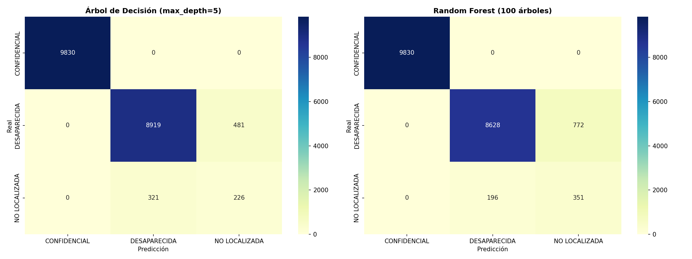
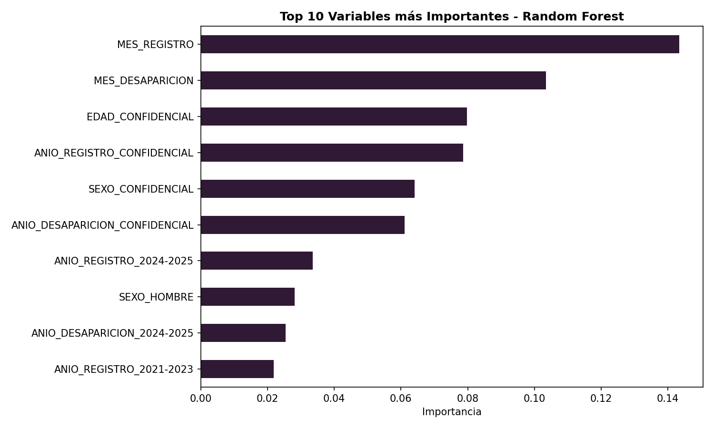

# Introducción

## Contexto del problema

Los derechos humanos buscan asegurar la dignidad de las personas, su propósito radica en salvaguardar y garantizar el bien común sin discriminar por raza, sexo, religión, edad, ideologías, entre otros aspectos. Asimismo, el reconocimiento de los derechos humanos a partir de 1948 (proclamados en la Declaración Universal de los Derechos Humanos por la ONU) señala derechos inherentes a los individuos por el hecho de ser humanos, proporcionando una protección a no sufrir tratos crueles, inhumanos o degradantes.

La desaparición de personas es un problema de seguridad y justicia, es un fenómeno que viola la dignidad del ser humano, la cual se basa en el reconocimiento de la libertad e igualdad en sus derechos. Esta privación de libertad atenta contra los derechos humanos de las personas, afecta a las víctimas y a sus familias, sembrando miedo e incertidumbre en la sociedad.

México es un país que alberga tradiciones y costumbres inigualables, sin embargo, no está exento de ser afectado por la violencia. Los índices de violencia han incrementado con el tiempo y se ha normalizado este fenómeno provocando falta de empatía y solidaridad en la sociedad, evidenciando la desigualdad. Con esto, la desaparición de personas en México ha experimentado un aumento constante y alarmante, generando una profunda crisis de derechos humanos.

Como continuación del análisis anterior sobre conjuntos de datos de los registros de estas desapariciones, en el presente trabajo buscamos continuar aplicando técnicas de minería de datos para encontrar reglas de asociación y construir modelos de clasificación que nos ayuden a encontrar nuevos patrones e información que aporte nuevas perspectivas de esta problemática.

Además, en el desarrollo de este trabajo reconocemos la importancia de este tema que nos incumbe a todos como humanidad, es un tema que ha sembrado desesperanza no sólo en México, sino en varias partes del mundo, es por ello que lo debemos tratar con la delicadeza y detalle que merece.

## Objetivos

Aplicar técnicas fundamentales de minería de datos (específicamente el descubrimiento de reglas de asociación y la construcción de modelos de clasificación) sobre un conjunto de datos real y limpio de personas desaparecidas. El propósito central es extraer patrones subyacentes e implementar predicciones automatizadas, evaluando críticamente tanto el rendimiento técnico de los algoritmos como las implicaciones del mundo real y los posibles sesgos presentes en el sistema de registro.

## Descripción del dataset

Para cumplir con los objetivos del presente trabajo contamos con un archivo que contiene información de los registros de personas desaparecidas en México. En total hay **133,887 registros** (que pueden contener campos vacíos), para cada uno de ellos hay 11 variables (características de cada registro).

Los campos con los que cuenta cada registro son los siguientes:

| Nombre de columna | Descripción | Tipo de dato | Datos no nulos |
|:--- |:--- |:---: |:---:|
| id_victima | Identificador único alfanumérico asignado a cada registro. Variable cualitativa nominal. | string | 133,887 |
| origen_reporte | Institución, fiscalía o comisión de búsqueda que emite o registra el caso. Variable cualitativa nominal. | string | 133,887 |
| fecha_nacimiento | Día, mes y año en el que nació la persona. Variable cualitativa. | datetime | 105,000 |
| sexo | Género de la víctima: HOMBRE o MUJER. Variable cualitativa nominal. | string | 133,887 |
| fecha_desaparicion | Fecha y hora del último avistamiento o reporte. Variable cualitativa. | datetime | 125,727 |
| fecha_registro | Fecha y hora de ingreso formal al sistema. Variable cualitativa. | datetime | 127,790 |
| estatus_victima | Condición actual de la persona en el sistema. Variable cualitativa nominal. | string | 133,887 |
| cve_ent | Clave numérica oficial de la Entidad Federativa (INEGI). Variable cualitativa. | int64 | 133,887 |
| entidad | Nombre del Estado de la República Mexicana. Variable cualitativa. | string | 133,887 |
| cve_mun | Clave numérica oficial del Municipio (INEGI). Variable cualitativa. | int64 | 133,887 |
| municipio | Nombre del municipio o alcaldía. Variable cualitativa. | string | 133,887 |

: Diccionario de datos del registro de víctimas {#tbl-descripciondataset tbl-colwidths="[20,50,15,15]"}

Con esta información podemos ver que en varios campos (id_victima, origen_reporte, sexo, estatus_victima, cve_ent, entidad, cve_mun, municipio) se cuenta con los registros completos, sin embargo, al observar los datos se identificó que muchos están completados con: CONFIDENCIAL, por lo que debemos considerar esto al realizar nuestros análisis.

# Algoritmo Apriori

## Descripción

Este algoritmo es un método en el análisis de datos para encontrar grupos de elementos que suelen aparecer juntos en grandes conjuntos de datos. Es esencial en el descubrimiento de patrones o reglas útiles sobre cómo se relacionan los elementos.

Los pasos claves que implementaremos en este algoritmo son:

1. **Identificación de conjuntos de elementos frecuentes:** Se examinan todos los datos para contar las apariciones de elementos y se usa el soporte mínimo para determinar si el conjunto es frecuente o no. 

2. **Creación de un posible grupo de elementos:** Tras identificar los elementos individuales que cumplieron con el soporte mínimo se combinan dichos conjuntos para crear pares y luego conjuntos de 3 y así sucesivamente hasta que no se puedan encontrar conjuntos más grandes.

3. **Eliminación de grupos de artículos poco frecuentes:** si un grupo de elementos no aparece con la suficiente frecuencia, entonces cualquier grupo más grande que incluya estos elementos tampoco aparecerá con frecuencia. 

4. **Generación de reglas de asociación:** Se comprueban las reglas utilizando el soporte, la confianza y el lift para identificar las más fuertes.

Para la implementación en Python de este algoritmo se crearon las siguientes funciones auxiliares:

* *obtener_itemsets_frecuentes_1(transacciones, soporte_min_conteo)*
    * Esta función nos ayuda a generar todos los itemsets frecuentes de tamaño 1, sólo devuelve aquellos que son considerados frecuentes, es decir, los que cumplen con el soporte mínimo. Esto nos ayuda en el primer paso del algoritmo.

* *generar_candidatos(itemsets_frecuentes, k)*
    * Esta función nos ayuda con el segundo paso de nuestro algoritmo, por lo que genera itemsets de tamaño k que pueden ser o no frecuentes, sólo genera las combinaciones a partir de la iteración anterior.

* *filtrar_candidatos(transacciones, candidatos, soporte_min_conteo)*
    * Con esta función nos aseguramos de quedarnos únicamente los itemsets generados anteriormente que cumplan con el soporte mínimo establecido. Esto asegura nuestro tercer paso de eliminación de grupos poco frecuentes.

Estas funciones nos dan la pauta para la implementación completa del algoritmo apriori, el cual devuelve todos los itemsets generados. Para generar las reglas usamos otra función que recibe lo que devuelve nuestro algoritmo apriori:

* *generar_reglas(itemsets_frecuentes, confianza_min)*
    * Encuentra las reglas lógicas a partir de los itemsets recibidos y considerando el mínimo de confianza establecido.

## Python

A continuación se presenta la implementación completa en Python:

```{python}
#| eval: false
import pandas as pd
from itertools import combinations


def obtener_itemsets_frecuentes_1(transacciones, soporte_min_conteo):
    """
    Escanea toda la base de datos para contar cuántas veces aparece cada elemento individualmente. 
    Luego, descarta los que no alcanzan el umbral mínimo.

    Args:
        transacciones (list): Lista de listas. Cada lista representa un registro con sus características soporte_min_conteo (int): Número de veces que debe aparecer un elemento para considerarlo frecuente

    Returns:
        dict: Diccionario donde las claves son los elementos frecuentes encapsulados en un frozenset y los valores son su conteo exacto
    """
    conteo = {}
    for transaccion in transacciones:
        for item in transaccion:
            # Usamos frozenset para poder usar el set como llave en el diccionario
            llave = frozenset([item])
            conteo[llave] = conteo.get(llave, 0) + 1
            
    # Filtramos por el soporte mínimo
    return {itemset: count for itemset, count in conteo.items() if count >= soporte_min_conteo}


def generar_candidatos(itemsets_frecuentes, k):
    """
    Toma los conjuntos frecuentes del paso anterior (tamaño k-1) y los combina entre sí para crear 
    nuevos grupos candidatos más grandes (de tamaño k).

    Args:
        itemsets_frecuentes (dict): Diccionario de elementos frecuentes
        k (int): Tamaño de los nuevos conjuntos

    Returns:
        set: Conjunto que contiene múltiples frozenset de tamaño k, es importante aclarar que aquí son
             candidatos, aún no se confirma si son frecuentes
    """
    candidatos = set()
    lista_itemsets = list(itemsets_frecuentes.keys())
    
    for i in range(len(lista_itemsets)):
        for j in range(i + 1, len(lista_itemsets)):
            # Unimos dos itemsets
            union = lista_itemsets[i] | lista_itemsets[j]
            # Si el tamaño de la unión es exactamente k, es un candidato válido
            if len(union) == k:
                candidatos.add(union)
    return candidatos


def filtrar_candidatos(transacciones, candidatos, soporte_min_conteo):
    """
    Escanea la base de datos completa para ver cuántas veces aparecen juntos realmente los elementos de cada 
    conjunto candidato.

    Args:
        transacciones (list): Base de datos
        candidatos (set): Conjunto de candidatos a revisar
        soporte_min_conteo (int): Número de veces que debe aparecer un elemento para considerarlo frecuenta

    Returns:
        dict: Diccionario con los candidatos que su conteo fue mayor o igual a soporte_min_conteo
    """
    conteo = {candidato: 0 for candidato in candidatos}
    
    for transaccion in transacciones:
        transaccion_set = set(transaccion)
        for candidato in candidatos:
            if candidato.issubset(transaccion_set):
                conteo[candidato] += 1
                
    return {itemset: count for itemset, count in conteo.items() if count >= soporte_min_conteo}


def algoritmo_apriori(transacciones, soporte_min=0.1):
    """
    Encuentra grupos de elementos que suelen aparecer juntos en grandes conjuntos de datos.

    Args:
        transacciones (list): Base de datos con las transacciones
        min_support (float, optional): Porcentaje de soporte mínimo deseado. Defaults to 0.1.

    Returns:
        dict: Diccionario que contiene todos los conjuntos frecuentes encontrados de cualquier tamaño 
              y su respectivo porcentaje de aparición (de 0 a 1).
    """
    total_transacciones = len(transacciones)
    min_support_count = soporte_min * total_transacciones
    
    itemsets_todos = {}
    
    # Obtener frecuentes de tamaño 1
    itemsets_k = obtener_itemsets_frecuentes_1(transacciones, min_support_count)
    itemsets_todos.update(itemsets_k)
    
    # Bucle para k = 2, 3, 4...
    k = 2
    while itemsets_k:
        candidatos = generar_candidatos(itemsets_k, k)
        itemsets_k = filtrar_candidatos(transacciones, candidatos, min_support_count)
        itemsets_todos.update(itemsets_k)
        k += 1
        
    # Devolvemos los itemsets con su soporte en porcentaje (0 a 1)
    return {itemset: count / total_transacciones for itemset, count in itemsets_todos.items()}


def generar_reglas(itemsets_frecuentes, confianza_min):
    """Toma los conjuntos de elementos frecuentes y aplica probabilidad condicional para encontrar reglas lógicas.

    Args:
        itemsets_frecuentes (dict): Diccionario generado por el algoritmo apriori
        confianza_min (float): El umbral mínimo de certeza que debe tener la regla

    Returns:
        pandas.DataFrame: Tabla estructurada y ordenada con las reglas de asociación
    """
    reglas = []
    
    # Para cada itemset frecuente encontrado en apriori
    for itemset, support in itemsets_frecuentes.items():
        if len(itemset) > 1:
            # Iteramos para crear todas las combinaciones posibles de antecedente -> consecuente
            for i in range(1, len(itemset)):
                for antecedente in combinations(itemset, i):
                    antecedente = frozenset(antecedente)
                    consecuente = itemset - antecedente
                    
                    soporte_antecedente = itemsets_frecuentes[antecedente]
                    confianza = support / soporte_antecedente
                    
                    if confianza >= confianza_min:
                        soporte_consecuente = itemsets_frecuentes[consecuente]
                        lift = confianza / soporte_consecuente
                        
                        reglas.append({
                            'Antecedente': set(antecedente),
                            'Consecuente': set(consecuente),
                            'Soporte': support,
                            'Confianza': confianza,
                            'Lift': lift
                        })
                        
    return pd.DataFrame(reglas).sort_values(by='Lift', ascending=False)
```

En adición al algoritmo se anexa una función para obtener la lista de transacciones de una base de datos a partir de un dataframe, esto para poder facilitar los siguientes análisis a nuestro conjunto de datos sobre los registros de personas desaparecidas en México:

```{python}
#| eval: false
def df_a_transacciones(df):
    """
    Convierte un DataFrame de Pandas en una lista de transacciones (lista de listas)
    formateada para el algoritmo apriori.
    
    Args:
        df (pd.DataFrame): El DataFrame con los datos originales.
    
    Returns:
        list: Una lista de listas lista que representa las transacciones del dataframe
    """
    columnas = df.columns.tolist()
    transacciones = []
    for index, fila in df.iterrows():
        transaccion = [f"{col}={fila[col]}" for col in columnas]
        transacciones.append(transaccion)
            
    return transacciones
```
# Descubrimiento de patrones: Reglas de Asociación
## Conocimiento de la problemática
Como se definió en la sección de Objetivo del proyecto, se cuenta con un conjunto de datos reales relacionados con la desaparición de personas en México. A partir de ello, se busca identificar información relevante dentro del conjunto de datos, es decir, subconjuntos de variables que presenten algún tipo de correlación. En este contexto, el objetivo es encontrar relaciones del tipo X ⇒ Y, conocidas como patrones, las cuales constituyen el eje principal del aprendizaje no supervisado.

Estos patrones permiten extraer conocimiento útil a partir de los datos disponibles. Por ejemplo, una regla como (SEXO = MUJER, EDAD = 17 ⇒ ENTIDAD_FEDERATIVA = X) podría ayudar a responder preguntas como: ¿en qué entidad federativa es más probable que desaparezca una mujer de 17 años?

El objetivo principal es construir un modelo basado en reglas de asociación no triviales. A lo largo del proceso, dichas reglas podrán ajustarse y refinarse, con la finalidad de obtener resultados más precisos y relevantes, facilitando así su interpretación y análisis.

## Analítica y preparación de datos
El conjunto de datos con el que se trabaja consta de **133,887 registros**. Para aplicar el algoritmo Apriori, es necesario transformar primero los datos a un formato transaccional. Este proceso se realiza mediante la función `df_a_transacciones()`, definida en la sección anterior, mientras que la función `algoritmo_apriori()` permite operar sobre dichas transacciones.

En este contexto, cada **transacción** corresponde a un registro del conjunto de datos, es decir, a la información asociada a una persona desaparecida. Internamente, las transacciones se representan mediante una **matriz binaria**, donde cada fila corresponde a una transacción y cada columna a un *ítem* (atributo en forma categórica).

En esta matriz, se asigna el valor **1 (True)** en la posición *(i, j)* si la transacción *i* contiene el ítem *j*, y **0 (False)** en caso contrario. Esta representación permite identificar de manera eficiente la presencia o ausencia de atributos en cada registro.

En el siguiente listado se muestra el código necesario para construir dicha matriz binaria, cuya importancia radica en que constituye el punto de entrada para algoritmos de minería de datos como Apriori, los cuales permiten posteriormente generar reglas de asociación.
  
 
```{python}
#| eval: false
from mlxtend.preprocessing import TransactionEncoder
frame = pd.read_csv("data_secretariado.csv")
transacciones = df_a_transacciones(frame)
codificador = TransactionEncoder()
transacciones_codificadas = codificador.fit_transform(transacciones)
transacciones_codificadas = pd.DataFrame(transacciones_codificadas, columns=codificador.columns_)
transacciones_codificadas
```
::: {.tbl-cap}
Vista parcial del conjunto de datos transformado a formato transaccional (one-hot encoding)
:::

| index | CVE_ENT=10 | CVE_ENT=11 | CVE_ENT=13 | ... | ORIGEN_REPORTE=SE DESCONOCE | ... | SEXO=CONFIDENCIAL | SEXO=HOMBRE | SEXO=MUJER |
|------:|:----------:|:----------:|:----------:|:---:|:---------------------------:|:---:|:-----------------:|:-----------:|:-----------:|
| 0     | True       | False      | False      | ... | False                       | ... | True              | False       | False       |
| 1     | False      | False      | False      | ... | False                       | ... | False             | True        | False       |
| 2     | False      | False      | False      | ... | False                       | ... | True              | False       | False       |
| 3     | False      | False      | False      | ... | False                       | ... | True              | False       | False       |
| 4     | False      | False      | False      | ... | False                       | ... | True              | False       | False       |
| ...   | ...        | ...        | ...        | ... | ...                         | ... | ...               | ...         | ...         |
| 133882| False      | True       | False      | ... | False                       | ... | False             | True        | False       |
| 133883| False      | False      | True       | ... | False                       | ... | False             | False       | True        |
| 133884| False      | False      | False      | ... | False                       | ... | False             | True        | False       |

Como se puede observar, para cada elemento *(i, j)* se asignan valores **0/1 (False/True)** dependiendo de si el ítem *j* está presente en la transacción *i*. 
Esta representación puede interpretarse de la siguiente manera: por ejemplo, si se tiene *(index = 1, SEXO=HOMBRE = True)*, esto indica que la transacción correspondiente al registro 1 pertenece a una persona desaparecida de sexo masculino.
De igual manera, podemos sacar más información con respecto a las transacciones, como:

```{python}
#| eval: false
numero_transacciones = len(transacciones_codificadas)
dimensiones = transacciones_codificadas.shape
numero_items = transacciones_codificadas.shape[1]
proporcion = transacciones_codificadas.to_numpy().mean()
print(f'numero de transacciones : {numero_transacciones}')
print(f'dimensiones : {dimensiones}')
print(f'items distintos : {numero_items}')
print(f"Presencia de items : {round(proporcion, 6)}")
```

```{.output}
numero de transacciones : 131715
dimensiones : (131715, 255842)
items distintos : 255842
Presencia de items : 4.3e-05 
```

En principio, se observa un aspecto relevante: la cantidad de ítems en la matriz es extremadamente alta, alcanzando aproximadamente **255,000 ítems distintos**. A partir de este volumen, se obtiene que la proporción de ítems presentes por transacción es muy baja, lo que indica una **alta dispersión (sparsity)** en los datos.

En otras palabras, la mayoría de las transacciones contienen muy pocos ítems en relación con el total disponible, lo que implica que predominan los valores de ausencia (*False*) sobre los de presencia (*True*). Esta situación representa un reto importante al aplicar el algoritmo de reglas de asociación, ya que puede afectar tanto la eficiencia computacional como la calidad de los resultados.

Si se utiliza el conjunto de datos sin ningún tipo de tratamiento previo, es probable que muchas de las reglas generadas sean triviales o poco informativas. Esto se debe a que el algoritmo puede identificar relaciones que, aunque cumplen con los criterios de soporte y confianza, no aportan conocimiento significativo. Además, el alto número de ítems incrementa considerablemente el costo computacional del proceso.

### Preparación de datos

Durante la inspección del conjunto de datos, se identificaron atributos que no aportan valor para la generación de reglas de asociación. Un ejemplo de ello es el atributo `ID_VICTIMA`, el cual corresponde a un identificador único por registro. Debido a su **naturaleza no repetitiva**, este tipo de variable no contribuye a la generación de patrones frecuentes, por lo que se optó por eliminarlo.

De manera similar, las variables codificadas como `CVE_ENT` o `CVE_MUN` representan la misma información que atributos categóricos como `ENTIDAD_FEDERATIVA` y `MUNICIPIO`. La inclusión simultánea de ambas representaciones introduce **redundancia** en los datos y puede dar lugar a reglas triviales (por ejemplo, equivalencias directas entre códigos y nombres).

Por esta razón, se decidió conservar únicamente las variables categóricas nominales (`ENTIDAD_FEDERATIVA` y `MUNICIPIO`), ya que proporcionan una interpretación más clara y descriptiva, y eliminar las variables codificadas correspondientes. Esta decisión contribuye a reducir la dimensionalidad del conjunto de datos y a mejorar la calidad de las reglas generadas.
Como primer paso, se realiza la **discretización de variables continuas**, especialmente aquellas que, debido a su alta granularidad, pueden incrementar significativamente la dimensionalidad de la matriz binaria generada en el preprocesamiento. Un caso representativo es el de las variables de tipo fecha.

En particular, la variable `FECHA_NACIMIENTO` no aporta directamente un valor semántico relevante para la generación de patrones; sin embargo, puede utilizarse como base para derivar una nueva variable más significativa: la **edad**. Esta se obtiene a partir de la diferencia entre `FECHA_DESAPARICION` y `FECHA_NACIMIENTO`, permitiendo representar de forma más adecuada las características demográficas de los registros.

Adicionalmente, se identificó que las variables temporales pueden contener patrones relevantes a nivel de agregación. Por ello, la variable `FECHA_DESAPARICION` se descompone en componentes de **año** y **mes**, descartando el día. Esta decisión se justifica en que el día introduce una alta variabilidad (alta cardinalidad), lo que incrementa innecesariamente el número de ítems sin aportar, en la mayoría de los casos, información significativa para el descubrimiento de patrones.

Este proceso refleja una consideración importante en el uso de reglas de asociación: el rendimiento y la calidad de los patrones obtenidos dependen en gran medida del control de la **dimensionalidad del espacio de ítems**. Variables continuas con amplios rangos tienden a generar una gran cantidad de valores únicos, lo que se traduce en una matriz altamente dispersa y en una reducción de la efectividad del algoritmo.

Por esta razón, se opta por discretizar variables como la edad (agrupándola en rangos) y transformar las variables de fecha, conservando únicamente componentes como el mes y el año. Estas decisiones permiten reducir la dimensionalidad, mejorar la interpretabilidad de los resultados y facilitar la generación de reglas de asociación más relevantes.

### Tratamiento de datos faltantes (MCAR vs MAR)

En el análisis de datos es fundamental identificar la naturaleza de los valores faltantes (representados como *NaN* en *pandas*) y definir estrategias adecuadas para su tratamiento. En el conjunto de datos analizado, de un total de **133,887 registros**, aproximadamente **34,964** presentan al menos un valor faltante en variables categóricas relevantes para el descubrimiento de patrones, particularmente aquellas relacionadas con `FECHA_NACIMIENTO`, `FECHA_DESAPARICION` y `FECHA_REGISTRO`.

Considerando que estas variables son clave para la generación de atributos derivados (como la edad o componentes temporales), la imputación de valores —ya sea mediante moda en variables categóricas o técnicas como KNN— puede introducir sesgos significativos. En el contexto de reglas de asociación, este problema es especialmente crítico, ya que dichas técnicas se basan en la frecuencia de co-ocurrencia de los ítems.

En particular, la imputación puede alterar artificialmente métricas como el **soporte**, la **confianza** y el **lift**, inflando la frecuencia de ciertos patrones y generando reglas que no reflejan relaciones reales en los datos. Dado que estas métricas se interpretan en términos de probabilidades condicionadas, condicionar sobre datos imputados puede distorsionar la interpretación de los resultados y comprometer la validez del análisis.

Por otro lado, la proporción de datos completos (~74%) sigue siendo suficientemente representativa para la identificación de patrones relevantes. En este sentido, se opta por evitar la imputación y trabajar con un enfoque de **análisis de casos completos**, priorizando la integridad de los datos observados.

A continuación, se describe el proceso de preprocesamiento de la información:

```{python}
#| eval: False
import matplotlib.pyplot as plt
import seaborn as sns

# Creamos una copia para no afectar el dataframe original antes de la limpieza
df_analysis = frame.copy()

# Creamos indicadores booleanos de nulos para las fechas
df_analysis['FECHA_DESAPARICION_NULL'] = df_analysis['FECHA_DESAPARICION'].isna()
df_analysis['FECHA_NACIMIENTO_NULL'] = df_analysis['FECHA_NACIMIENTO'].isna()

# 1. Análisis por SEXO
missing_by_sex = df_analysis.groupby('SEXO')[['FECHA_DESAPARICION_NULL', 'FECHA_NACIMIENTO_NULL']].mean()

# 2. Análisis por ENTIDAD (Top 15 con más registros para mejor visualización)
top_entidades = df_analysis['ENTIDAD'].value_counts().nlargest(15).index
df_top_entidades = df_analysis[df_analysis['ENTIDAD'].isin(top_entidades)]
missing_by_entidad = df_top_entidades.groupby('ENTIDAD')[['FECHA_DESAPARICION_NULL', 'FECHA_NACIMIENTO_NULL']].mean()

# Visualización
fig, axes = plt.subplots(1, 2, figsize=(16, 6))

sns.heatmap(missing_by_sex, annot=True, cmap='YlGnBu', ax=axes[0])
axes[0].set_title('Proporción de Nulos por SEXO')

sns.heatmap(missing_by_entidad, annot=True, cmap='YlGnBu', ax=axes[1])
axes[1].set_title('Proporción de Nulos por ENTIDAD (Top 15)')

plt.tight_layout()
plt.show()
```


A partir del análisis visual mediante el heatmap, se observa que la variable `FECHA_DESAPARICION` en valores nulos no presenta un comportamiento claramente asociado a otras variables (no evidencia fuerte de un patrón MAR). En particular, aunque se identifican ligeras concentraciones en ciertos estados, la relación general es débil, con valores promedio cercanos a **0.3**, lo que sugiere una baja dependencia estructural.

Por otro lado, la variable `FECHA_NACIMIENTO` sí muestra un comportamiento distinto. En este caso, se identifica una fuerte asociación entre la ausencia de datos y la variable `SEXO`, específicamente con la categoría *INDETERMINADO*. Esta relación se refleja en una proporción aproximada de **0.83**, lo que indica que:

$$
P(\text{FECHA\_NACIMIENTO} = \text{null} \mid \text{SEXO} = \text{INDETERMINADO}) \approx 0.83
$$

Este resultado sugiere un patrón consistente con un mecanismo de datos faltantes tipo MAR (Missing At Random), donde la probabilidad de ausencia depende de otra variable observada. En términos prácticos, implica que los registros correspondientes a personas con sexo indeterminado son significativamente más propensos a carecer de información sobre su fecha de nacimiento.

Dado que en este trabajo se opta por no realizar imputación —con el objetivo de preservar la integridad de los datos observados para el análisis mediante reglas de asociación—, se decide trabajar con un enfoque de **análisis de casos completos**. Sin embargo, esta decisión introduce un sesgo importante, ya que afecta de manera desproporcionada a este grupo específico de registros.

Por lo tanto, es importante reconocer esta situación como una de las principales limitaciones del conjunto de datos, ya que ciertos patrones asociados a este grupo podrían quedar subrepresentados en el análisis final.

### Manejo de datos confidenciales
Otro aspecto relevante a considerar es la consistencia de la información disponible para la generación de reglas de asociación con métricas confiables. A partir del preprocesamiento, se cuenta con **98,923 registros completos** (sin valores nulos); sin embargo, aún persiste una limitación importante asociada a la presencia del valor *CONFIDENCIAL* en múltiples variables.

Este fenómeno introduce un reto adicional en el análisis, ya que puede afectar la calidad e interpretabilidad de los patrones descubiertos. En particular, resulta relevante evaluar si es posible obtener reglas significativas cuando intervienen variables con valores confidenciales, así como identificar si existen patrones de co-ocurrencia sistemáticos entre dichas variables.

El análisis exploratorio muestra que la confidencialidad no se distribuye de manera uniforme: mientras varias variables presentan este valor, otras como `ENTIDAD` y `ORIGEN_REPORTE` no contienen registros confidenciales. Esta característica las posiciona como variables clave para el análisis, al permitir la identificación de asociaciones más interpretables dentro del conjunto de datos.

```{python}
# | eval: False
confidential_count = 0

for index, row in frame.iterrows():
    # Si 'CONFIDENCIAL' existe en cualquier columna
    if 'CONFIDENCIAL' in row.values:
        confidential_count += 1

print(f"Total de registros analizados: {len(frame)}")
print(f"Registros con al menos un dato 'CONFIDENCIAL': {confidential_count}")
print(f"Proporción sobre el total actual: {round(confidential_count / len(frame) * 100, 2)}%")
```
```{.output}
Total de registros analizados: 98923
Registros con al menos un dato 'CONFIDENCIAL': 49149
Proporción sobre el total actual: 49.68%
```
Se observa que aproximadamente el **49.68%** de los registros contienen al menos un valor *CONFIDENCIAL*. Este resultado indica que una proporción significativa del conjunto de datos presenta algún nivel de ocultamiento de información, lo cual puede influir en la generación y calidad de los patrones obtenidos.

Adicionalmente, se identifica que los valores confidenciales no aparecen de manera aislada, sino que tienden a presentarse simultáneamente en múltiples variables. En particular, se observa que **5 de las 7 variables analizadas** presentan valores *CONFIDENCIAL* de forma conjunta en un subconjunto considerable de registros.

Este comportamiento sugiere una **dependencia probabilística** entre dichas variables, en el sentido de que la ocurrencia de confidencialidad en una variable incrementa la probabilidad de observar el mismo valor en las demás. En términos de distribución conjunta, esto indica que estos eventos no son independientes y presentan una alta co-ocurrencia dentro de las transacciones.


```{python}
# | eval: False
confidential_count = 0

for index, row in frame.iterrows():
  
    valor_nacimiento = row['FECHA_NACIMIENTO']
    valor_desaparicion =  row['FECHA_DESAPARICION']
    valor_registro = row['FECHA_REGISTRO']
    valor_municipio = row['MUNICIPIO']
    valor_entidad = row['ENTIDAD']
    valor_sexo = row['SEXO']
    valor_status = row['ESTATUS_VICTIMA']

    existe = (valor_nacimiento == 'CONFIDENCIAL'
    and valor_registro == 'CONFIDENCIAL'
    and valor_municipio == 'CONFIDENCIAL'
    and valor_sexo == 'CONFIDENCIAL'
    and valor_status == 'CONFIDENCIAL')

    if existe:
      confidential_count += 1

print(f"Total de registros analizados: {len(frame)}")
print(f"Registros con al menos un dato 'CONFIDENCIAL': {confidential_count}")
```
```{.output}
Total de registros analizados: 98923
Registros con al menos un dato 'CONFIDENCIAL': 49149
```

Como se observa, **5 de las 7 variables analizadas presentan valores confidenciales**, y además se identifica que la proporción de registros con al menos un valor *CONFIDENCIAL* coincide con aquellos en los que estas cinco variables toman dicho valor de manera conjunta. Esto sugiere una **dependencia probabilística** entre dichas variables, es decir, la presencia de confidencialidad en una de ellas incrementa significativamente la probabilidad de que las demás también presenten este valor.

Este comportamiento permite considerar la posibilidad de encontrar reglas de asociación más complejas, particularmente en relación con las variables que no presentan este problema, como `ENTIDAD` y `ORIGEN_REPORTE`. En particular, se observa que `ENTIDAD` no contiene valores confidenciales, lo que la convierte en una variable relevante para el análisis.

Por otro lado, las reglas que involucren combinaciones como `{CONFIDENCIAL, CONFIDENCIAL}`, o que no aporten información significativa, son descartadas, ya que no contribuyen a la generación de conocimiento útil.

En este sentido, se opta por **mantener el valor CONFIDENCIAL como una categoría dentro de las variables categóricas**, en lugar de eliminarlo. Esta decisión permite conservar la estructura probabilística de las transacciones y evitar la pérdida de asociaciones entre variables no confidenciales, como `ENTIDAD` y `ORIGEN_REPORTE`. No obstante, se reconoce que esta elección puede introducir limitaciones en la interpretabilidad de las reglas generadas.

### Discretizacion de variables continuas 
Como se observa, el umbral de aparición de ítems distintos en la matriz binaria es muy bajo. Esto se debe, en gran medida, al manejo de variables de tipo fecha, ya que pequeñas variaciones —como diferencias en la hora— generan nuevos ítems, incrementando la dimensionalidad del espacio y reduciendo la frecuencia relativa de co-ocurrencia entre ellos.

Asimismo, se identifica que las variables `FECHA_NACIMIENTO` y `FECHA_DESAPARICION` funcionan como variables auxiliares para la construcción de un atributo más representativo: la **edad**. Esta se obtiene a partir de la diferencia entre los años de ambas fechas, permitiendo capturar patrones más interpretables asociados a grupos etarios. En consecuencia, se crea la variable `EDAD` y se elimina `FECHA_NACIMIENTO`.

Por su parte, la variable `FECHA_DESAPARICION`, así como `FECHA_REGISTRO`, se descomponen en componentes de **año** y **mes**, eliminando la granularidad asociada al día y la hora. Esta transformación reduce la cardinalidad de los datos y favorece la generación de patrones más generales. No obstante, estas nuevas variables requieren un proceso posterior de discretización para su adecuado uso en reglas de asociación.

La estrategia de transformación y construcción de variables se detalla a continuación:

```{python}
#| eval: False
# Convertimos temporalmente a datetime para extraer el año, ignorando errores para valores como 'CONFIDENCIAL'
anio_desaparicion = pd.to_datetime(frame['FECHA_DESAPARICION'], errors='coerce').dt.year
anio_nacimiento = pd.to_datetime(frame['FECHA_NACIMIENTO'], errors='coerce').dt.year

# Calculamos la edad como la diferencia simple de años
frame['EDAD'] = anio_desaparicion - anio_nacimiento
```
Posteriormente fragmentamos las fechas de las variables

```{python}
#| eval: False
# Convertimos a datetime temporalmente para extraer componentes
fecha_des_dt = pd.to_datetime(frame['FECHA_DESAPARICION'], errors='coerce')
fecha_reg_dt = pd.to_datetime(frame['FECHA_REGISTRO'], errors='coerce')

# Creamos las nuevas variables categóricas
frame['MES_DESAPARICION'] = fecha_des_dt.dt.month
frame['ANIO_DESAPARICION'] = fecha_des_dt.dt.year
frame['MES_REGISTRO'] = fecha_reg_dt.dt.month
frame['ANIO_REGISTRO'] = fecha_reg_dt.dt.year
```
Cuando ordenamos los valores se observa la presencia de edades negativas  donde indican registros donde el año de nacimiento es mayor al año de desaparición.

```{python}
#| eval: False
# Filtrar registros con edades negativas
inconsistentes = frame[frame['EDAD'] < 0]
print(f"Total de registros con edad negativa: {len(inconsistentes)}")
```
```{.output}
Total de registros con edad negativa: 39
```
Se identifican **39 registros** con edades negativas. Dado que su proporción es mínima respecto al total, se opta por eliminarlos. Aunque estos casos podrían estar asociados a un mecanismo de datos faltantes tipo MCAR, su impacto es reducido y su eliminación permite mantener la consistencia del conjunto de datos sin introducir sesgos derivados de imputación.

Adicionalmente, se observa que aproximadamente el **70%** de estos registros corresponden a personas de sexo masculino, lo que indica que este grupo es el más afectado por errores de captura en este subconjunto específico. Si bien esta eliminación introduce una ligera pérdida de representación para dicho grupo, su impacto global en el análisis es limitado debido a la baja proporción de estos casos.

```{python}
#| eval: False
frame = frame[~(frame['EDAD'] < 0)]

#Copiamos una referencia para graficar la distribucion continua de las edades
frame_continuas = frame.copy()

# Eliminamos las columnas que tengan que ver con la fecha
frame = frame.drop(['FECHA_DESAPARICION', 'FECHA_REGISTRO', 'FECHA_NACIMIENTO'], axis=1)
```


Como se observa en el script, además de eliminar los registros inconsistentes, se genera una copia del *DataFrame* original (`frame_continuas`) con el objetivo de conservar la distribución continua de la variable `EDAD` para su posterior análisis.

Adicionalmente, se eliminan las variables originales de fecha (`FECHA_DESAPARICION`, `FECHA_REGISTRO`, `FECHA_NACIMIENTO`), dado que ya han sido transformadas en variables más adecuadas. Este paso contribuye a reducir la dimensionalidad del conjunto de datos y evita redundancia en la representación de la información.
Una vez tratados los valores inconsistentes, se procede a discretizar la variable `EDAD` en intervalos definidos. La discretización se realiza mediante la construcción de categorías ordinales: **INFANTE, ADOLESCENTE, JOVEN, ADULTO y ADULTO_MAYOR**, utilizando un conjunto de *bins* no necesariamente equidistantes.

Adicionalmente, los valores no definidos (derivados de datos faltantes o inconsistentes previos) se agrupan bajo la categoría *CONFIDENCIAL*, manteniendo coherencia con el tratamiento general de valores confidenciales en el conjunto de datos.

```{python}
#| eval: False
# Definir los bins y etiquetas para la discretización
bins = [0, 11, 20, 39, 59, float('inf')]
labels = ['INFANTE', 'ADOLESCENTE', 'JOVEN', 'ADULTO', 'ADULTO_MAYOR']

# Aplicar pd.cut para crear la nueva categoría
frame['EDAD'] = pd.cut(frame['EDAD'], bins=bins, labels=labels, include_lowest=True)

# Convertir a object o string para permitir la asignación de 'CONFIDENCIAL' a los nulos
frame['EDAD'] = frame['EDAD'].astype(object).fillna('CONFIDENCIAL')
print("\nConteo de categorías en EDAD:")
print(frame['EDAD'].value_counts())
```
```{.output}
Conteo de categorías en EDAD:
EDAD
CONFIDENCIAL    49156
JOVEN           26480
ADULTO          10765
ADOLESCENTE      7723
ADULTO_MAYOR     2730
INFANTE          2030
```
Como resultado de este proceso, la variable `EDAD` queda representada en forma discreta, lo que facilita su integración en el modelo de reglas de asociación. Se observa que la categoría *CONFIDENCIAL* concentra la mayor proporción de registros, lo cual es consistente con el análisis previo de confidencialidad (~49%).

Este comportamiento sugiere que la ausencia de información en variables relacionadas con la edad no es completamente aleatoria, y podría estar asociada a mecanismos de ocultamiento de información (posible MNAR). A pesar de ello, se mantiene esta categoría con el objetivo de preservar la estructura de los datos y evitar la pérdida de información relevante.

De manera complementaria, la visualización permite contrastar la distribución continua de las edades con su versión discretizada. Se observa una mayor concentración en los grupos de adolescentes y adultos jóvenes, mientras que los extremos (infantes y adultos mayores) presentan menor frecuencia.

Asimismo, se identifican valores atípicos, como edades superiores a 100 años o cercanas a 0, que pueden considerarse outliers. En lugar de eliminarlos, se opta por agruparlos dentro de las categorías existentes, particularmente en *ADULTO_MAYOR* e *INFANTE*, respectivamente. Esta decisión introduce un sesgo mínimo, dado que la proporción de estos casos es baja, y permite mantener la integridad del conjunto de datos.

En conjunto, la discretización de la variable `EDAD` permite reducir la complejidad del espacio de ítems, mejorar la interpretabilidad de los patrones y facilitar la generación de reglas de asociación más relevantes. Todo esto, es posible observarlo como se muestra a continuación. 

```{python}
# | eval: False
import matplotlib.pyplot as plt
import seaborn as sns

# Configuración de estilo con colores más profesionales
sns.set_theme(style="whitegrid")
# Aumentamos el tamaño de la figura para mejor visibilidad
fig, axes = plt.subplots(1, 2, figsize=(22, 10))

# 1. Histograma de Edades (Izquierda) - Rojo oscuro y curva KDE marcada (se mantiene)
sns.histplot(edades_numericas.dropna(), bins=50, kde=True, ax=axes[0], color='darkred', 
             line_kws={'linewidth': 4})
axes[0].set_title('Distribución de Edades Original (Antes de Discretizar)', fontsize=16, fontweight='bold')
axes[0].set_xlabel('Edad', fontsize=13)
axes[0].set_ylabel('Frecuencia', fontsize=13)

# 2. Gráfico de Barras (Derecha) - Paleta 'crest' para un acabado más profesional y elegante
orden_categorias = ['INFANTE', 'ADOLESCENTE', 'JOVEN', 'ADULTO', 'ADULTO_MAYOR', 'CONFIDENCIAL']
sns.countplot(data=frame, x='EDAD', order=orden_categorias, ax=axes[1], palette='crest', hue='EDAD', legend=False)
axes[1].set_title('Distribución por Categorías Discretizadas (Después)', fontsize=16, fontweight='bold')
axes[1].set_xlabel('Categoría de Edad', fontsize=13)
axes[1].set_ylabel('Frecuencia', fontsize=13)

plt.tight_layout()
plt.show()
```


A continuación, se procede a discretizar las variables `ANIO_DESAPARICION` y `ANIO_REGISTRO`. Las variables relacionadas con el mes se preservan sin transformación adicional, con el objetivo de mantener cierta granularidad temporal que permita identificar patrones específicos asociados a periodos mensuales.

Previo a la discretización, se analiza la distribución continua de ambas variables. Se observa que la función de densidad presenta un comportamiento creciente en los años más recientes, particularmente en los últimos cinco años. Asimismo, ambas distribuciones (año de desaparición y año de registro) muestran una forma similar, lo que sugiere una relación estrecha entre ambas variables.

No obstante, se identifican ligeras diferencias en las medidas de tendencia central: mientras que la mediana se mantiene alrededor del año 2020, la media presenta variaciones entre ambas distribuciones. Este comportamiento sugiere la posible existencia de registros donde la fecha de desaparición y la fecha de registro no coinciden temporalmente, lo que puede reflejar retrasos en el proceso de registro.


Para la discretización de los años, se considera el comportamiento observado en la distribución, particularmente el crecimiento en ciertos periodos. En lugar de utilizar intervalos de igual tamaño, se opta por definir **intervalos no equidistantes**, basados en criterios empíricos que reflejan cambios relevantes en la frecuencia de los datos a lo largo del tiempo.

Los intervalos definidos son:  
`['1962-1999', '2000-2006', '2007-2009', '2010-2015', '2016-2020', '2021-2023', '2024-2025', 'CONFIDENCIAL']`

Esta discretización permite agrupar los datos en segmentos temporales más representativos, reduciendo la cardinalidad y facilitando la generación de reglas de asociación más interpretables.

```{python}
#|eval: False
# Definir los bins y etiquetas para los intervalos de años solicitados
bins_anios = [1962, 1999, 2006, 2009, 2015, 2020, 2023, 2025]
labels_anios = ['1962-1999', '2000-2006', '2007-2009', '2010-2015', '2016-2020', '2021-2023', '2024-2025']

# Aplicar la discretización a ANIO_DESAPARICION
frame['ANIO_DESAPARICION'] = pd.cut(frame['ANIO_DESAPARICION'], bins=bins_anios, labels=labels_anios, include_lowest=True)
frame['ANIO_DESAPARICION'] = frame['ANIO_DESAPARICION'].astype(object).fillna('CONFIDENCIAL')

# Aplicar la discretización a ANIO_REGISTRO
frame['ANIO_REGISTRO'] = pd.cut(frame['ANIO_REGISTRO'], bins=bins_anios, labels=labels_anios, include_lowest=True)
frame['ANIO_REGISTRO'] = frame['ANIO_REGISTRO'].astype(object).fillna('CONFIDENCIAL')

# Definir los bins y etiquetas para los intervalos de años solicitados
bins_anios = [1962, 1999, 2006, 2009, 2015, 2020, 2023, 2025]
labels_anios = ['1962-1999', '2000-2006', '2007-2009', '2010-2015', '2016-2020', '2021-2023', '2024-2025']

# Aplicar la discretización a ANIO_DESAPARICION
frame['ANIO_DESAPARICION'] = pd.cut(frame['ANIO_DESAPARICION'], bins=bins_anios, labels=labels_anios, include_lowest=True)
frame['ANIO_DESAPARICION'] = frame['ANIO_DESAPARICION'].astype(object).fillna('CONFIDENCIAL')

# Aplicar la discretización a ANIO_REGISTRO
frame['ANIO_REGISTRO'] = pd.cut(frame['ANIO_REGISTRO'], bins=bins_anios, labels=labels_anios, include_lowest=True)
frame['ANIO_REGISTRO'] = frame['ANIO_REGISTRO'].astype(object).fillna('CONFIDENCIAL')

# Mostrar los conteos para verificar la discretización
print("\nDistribución ANIO_DESAPARICION:")
print(frame['ANIO_DESAPARICION'].value_counts())
print("\nDistribución ANIO_REGISTRO:")
print(frame['ANIO_REGISTRO'].value_counts())
```
Como resultado del proceso de discretización, se obtiene una distribución categórica para ambas variables. Se observa que la categoría *CONFIDENCIAL* concentra una proporción significativa de los registros, consistente con el análisis previo de confidencialidad.

Por otro lado, los intervalos más recientes (`2010-2025`) presentan la mayor concentración de registros, lo cual es coherente con el comportamiento creciente observado en la distribución continua. Asimismo, las distribuciones de `ANIO_DESAPARICION` y `ANIO_REGISTRO` mantienen una forma similar, lo que refuerza la relación entre ambas variables.

```{.output} 
Distribución ANIO_DESAPARICION:
ANIO_DESAPARICION
CONFIDENCIAL    49151
2024-2025       13672
2016-2020       12013
2010-2015       11267
2021-2023       10825
2007-2009        1361
2000-2006         306
1962-1999         289
Name: count, dtype: int64

Distribución ANIO_REGISTRO:
ANIO_REGISTRO
CONFIDENCIAL    49151
2024-2025       13757
2016-2020       11990
2010-2015       11233
2021-2023       10821
2007-2009        1353
2000-2006         301
1962-1999         278
Name: count, dtype: int64
```


Al visualizar las distribuciones discretizadas, se observa que las diferencias en medidas como la media se vuelven menos perceptibles debido al proceso de agrupación. Sin embargo, ambas variables conservan una estructura similar en términos de frecuencia por intervalo.

Esto indica que la discretización logra preservar las tendencias generales de los datos, al mismo tiempo que reduce la complejidad del espacio de ítems. Como resultado, se facilita la identificación de patrones temporales relevantes sin incurrir en una alta dimensionalidad.

```{python}
# | eval: False
# Configuración de estilo
sns.set_theme(style="whitegrid")
fig, axes = plt.subplots(1, 2, figsize=(22, 10))

# Definimos el orden cronológico para los ejes
orden_anios = ['1962-1999', '2000-2006', '2007-2009', '2010-2015', '2016-2020', '2021-2023', '2024-2025', 'CONFIDENCIAL']

# 1. Distribución Discretizada: Año de Desaparición
sns.countplot(data=frame, x='ANIO_DESAPARICION', order=orden_anios, ax=axes[0], palette='crest', hue='ANIO_DESAPARICION', legend=False)
axes[0].set_title('Distribución por Intervalos: Año de Desaparición', fontsize=16, fontweight='bold')
axes[0].set_xlabel('Intervalo de Año', fontsize=13)
axes[0].set_ylabel('Frecuencia', fontsize=13)
axes[0].tick_params(axis='x', rotation=45)

# 2. Distribución Discretizada: Año de Registro
sns.countplot(data=frame, x='ANIO_REGISTRO', order=orden_anios, ax=axes[1], palette='crest', hue='ANIO_REGISTRO', legend=False)
axes[1].set_title('Distribución por Intervalos: Año de Registro', fontsize=16, fontweight='bold')
axes[1].set_xlabel('Intervalo de Año', fontsize=13)
axes[1].set_ylabel('Frecuencia', fontsize=13)
axes[1].tick_params(axis='x', rotation=45)

plt.tight_layout()
plt.show()
```


## Construcción y evaluación del modelo de reglas 

```{python}
#|eval: False 
numero_transacciones = len(transacciones_codificadas)
dimensiones = transacciones_codificadas.shape
numero_items = transacciones_codificadas.shape[1]
proporcion = transacciones_codificadas.to_numpy().mean()
print(f'numero de transacciones : {numero_transacciones}')
print(f'dimensiones : {dimensiones}')
print(f'items distintos : {numero_items}')
print(f"Presencia de items : {round(proporcion, 6)}")
```
```{.output}
numero de transacciones : 98884
dimensiones : (98884, 1649)
items distintos : 1649
Presencia de items : 0.006064
```
Una vez finalizado el preprocesamiento, se observa una reducción considerable en la dimensionalidad de la matriz binaria, obteniendo 1,649 ítems distintos sobre un total de 98,884 transacciones.

La proporción de presencia de ítems (0.006064) indica que la matriz es altamente dispersa (sparse), es decir, la mayoría de las transacciones contienen un número reducido de ítems en comparación con el total posible. Este comportamiento es característico en problemas de reglas de asociación con variables categóricas de alta cardinalidad.

La baja densidad de la matriz implica un reto en la aplicación del algoritmo Apriori, particularmente en la selección del umbral mínimo de soporte, ya que valores demasiado altos podrían eliminar patrones relevantes, mientras que valores muy bajos incrementarían significativamente el costo computacional y la generación de reglas poco informativas.

No obstante, este comportamiento era esperado debido a la naturaleza del conjunto de datos y a las transformaciones realizadas durante el preprocesamiento, las cuales priorizan la interpretabilidad de los patrones sobre la densidad del espacio de ítems.

Con el objetivo de analizar la estructura de la matriz binaria, se realiza una visualización de un subconjunto de transacciones. En particular, se consideran las **primeras 15 transacciones** y los **50 ítems más frecuentes** dentro de este subconjunto. Para ello, se ordenan los ítems en función de su frecuencia, permitiendo identificar aquellos con mayor presencia relativa.

En la representación gráfica, cada punto indica la presencia de un ítem en una transacción específica, es decir, una posición *(i, j)* donde el valor es verdadero en la matriz binaria. Este tipo de visualización permite observar de manera directa la dispersión y los patrones de co-ocurrencia entre ítems.

```{python}
#| eval : False
def graficar_transacciones_con_nombres(datos: pd.DataFrame, inicio: int = 0, fin: int = 50, top_n_items: int = 30, titulo: str = ""):
    # Seleccionamos el rango de transacciones (segmentación)
    muestra = datos.iloc[inicio:fin]

    # Calculamos frecuencia global para seleccionar los ítems más importantes
    frecuencia_total = muestra.sum(axis=0).sort_values(ascending=False)
    top_items = frecuencia_total.head(top_n_items).index

    # Filtramos la muestra solo con el top N de ítems
    muestra_filtrada = muestra[top_items]

    # Obtenemos coordenadas
    coordenadas_y, coordenadas_x = muestra_filtrada.to_numpy().nonzero()

    # Ajuste de dimensiones
    ancho = max(10, top_n_items * 0.4)
    alto = max(6, (fin - inicio) * 0.2)

    plt.figure(figsize=(ancho, alto))

    # Color morado oscuro profesional (Deep Purple)
    plt.scatter(coordenadas_x, coordenadas_y, marker="s", s=150, color='#301934', alpha=0.9)

    plt.gca().invert_yaxis()

    # Eje X con los nombres de los ítems
    plt.xticks(
        ticks=range(len(top_items)),
        labels=top_items,
        rotation=90,
        fontsize=10
    )

    # Eje Y con los índices de transacciones
    plt.yticks(
        range(len(muestra)),
        [f"T{i+1}" for i in range(inicio, fin)],
        fontsize=9
    )

    plt.xlabel(f"Top {top_n_items} ítems más frecuentes", fontsize=12, fontweight='bold')
    plt.ylabel("Transacciones", fontsize=12, fontweight='bold')
    plt.title(titulo or f"Matriz Binaria(Top {top_n_items} Items)", fontsize=14, fontweight='bold')

    plt.grid(True, linestyle=':', alpha=0.5)
    plt.tight_layout()
    plt.show()
```

graficar_transacciones_con_nombres(
    datos=transacciones_codificadas,
    inicio=0,
    fin=15,
    top_n_items=50
)


La primera visualización muestra la co-ocurrencia de los ítems más frecuentes en un subconjunto reducido de transacciones:

A partir de esta representación, se observa que ciertos ítems aparecen de forma recurrente en múltiples transacciones, formando patrones verticales que indican alta frecuencia relativa. En contraste, otros ítems presentan una aparición más esporádica, lo que evidencia la heterogeneidad en la distribución de los datos
Particularmente se observa que los items relacionados con INFANTE, ESTADO DE MEXICO, HOMBRE, MUJER, DESAPARECIDA son de mayor 
co-ocurrencia en las transacciones 

## Generación de reglas

Para la generación de reglas sobre el dataset completo se utilizó FP-Growth con las 5 variables más relevantes del fenómeno: `SEXO`, `EDAD`, `ENTIDAD`, `ESTATUS_VICTIMA` y `MES_DESAPARICION`. La decisión de reducir a estas 5  columnas responde a dos criterios: primero, son las variables con mayor  relevancia semántica para el análisis de desapariciones; segundo, reducir  la dimensionalidad de 1,649 a 59 ítems mejora significativamente el  rendimiento del algoritmo sin perder los patrones principales.

```{python}
#| eval: false
columnas_reglas = ['SEXO', 'EDAD', 'ENTIDAD', 'ESTATUS_VICTIMA', 'MES_DESAPARICION']
frame_reglas = frame[columnas_reglas]
transacciones_full = df_a_transacciones(frame_reglas)

codificador_full = TransactionEncoder()
codif_full = codificador_full.fit_transform(transacciones_full)
df_full = pd.DataFrame(codif_full, columns=codificador_full.columns_)

SOPORTE_FINAL = 0.01
CONFIANZA_FINAL = 0.5

itemsets_final = fpgrowth(df_full, min_support=SOPORTE_FINAL, use_colnames=True)
reglas_final = association_rules(itemsets_final, 
                                  metric="confidence", 
                                  min_threshold=CONFIANZA_FINAL)
print(f"Reglas encontradas: {len(reglas_final)}")
```
```{.output}
Dataset codificado: 98884 transacciones, 59 items
Reglas encontradas: 1322
```

## Métricas utilizadas

Para evaluar la calidad de las reglas generadas se utilizaron:

**Soporte** mide la frecuencia del patrón en el dataset. Una regla 
$X \Rightarrow Y$ tiene soporte igual a la proporción de transacciones 
que contienen tanto $X$ como $Y$:

$$\text{soporte}(X \Rightarrow Y) = \frac{|\{t \in D : X \cup Y \subseteq t\}|}{|D|}$$

En este trabajo se estableció un soporte mínimo de **0.01**, equivalente a patrones presentes en al menos 988 de los 98,884 registros. Valores menores generaban una explosión computacional; valores mayores eliminaban patrones demográficos relevantes.

**Confianza** mide la probabilidad condicional de que ocurra el consecuente dado el antecedente:

$$\text{confianza}(X \Rightarrow Y) = \frac{\text{soporte}(X \cup Y)}{\text{soporte}(X)}$$

Se estableció una confianza mínima de **0.5**, garantizando que el  consecuente ocurra en al menos la mitad de los casos donde se presenta  el antecedente.

**Lift** mide si la asociación es genuina o casual, comparando la 
frecuencia observada con la esperada bajo independencia:

$$\text{lift}(X \Rightarrow Y) = \frac{\text{confianza}(X \Rightarrow Y)}{\text{soporte}(Y)}$$

Un lift mayor a 1 indica dependencia positiva; igual a 1 indica independencia; menor a 1 indica asociación negativa. En el análisis  final se priorizaron las reglas con lift mayor a 2.0 por representar  asociaciones sustancialmente más fuertes que el azar.

```{python}
#| eval: false
# Distribución de las métricas en el conjunto de reglas generadas
print("Estadísticos descriptivos de las métricas:")
print(reglas_final[['support', 'confidence', 'lift']].describe().round(4))
```
```{.output}
       support  confidence    lift
count  1322.00     1322.00  1322.00
mean      0.02        0.61     1.89
std       0.02        0.10     1.42
min       0.01        0.50     1.00
25%       0.01        0.54     1.19
50%       0.02        0.59     1.47
75%       0.03        0.66     2.14
max       0.50        1.00     7.17
```

Los estadísticos descriptivos muestran que el soporte promedio de las reglas es 0.02, lo que indica que la mayoría de los patrones encontrados son específicos y no generalizables a toda la población. El lift promedio de 1.89 confirma que las asociaciones son genuinas y no casuales. El valor máximo de lift de 7.17 corresponde a la regla de infantes en el Estado de México, que representa la asociación más fuerte del dataset.

## Refinamiento y ajuste

### Eliminacion de redundancia

Durante la fase de preparacion de datos se identificaron multiples fuentes de redundancia que afectaban la calidad de las reglas generadas:

**Variables duplicadas semanticamente:**
Se eliminaron las variables `CVE_ENT` y `CVE_MUN` por representar la misma informacion que `ENTIDAD` y `MUNICIPIO` respectivamente. Mantener ambas representaciones generaba reglas triviales del tipo `CVE_ENT=15 -> ENTIDAD=ESTADO DE MEXICO`, que no aportaban conocimiento nuevo sobre las desapariciones. Se conservaron las versiones nominales por su interpretabilidad directa.

**Identificadores unicos:**
La variable `ID_VICTIMA` fue eliminada por ser un identificador unico alfanumerico. Cada valor aparece exactamente una vez en el dataset, por lo que su soporte siempre seria aproximadamente 0.001%, muy por debajo de cualquier umbral razonable. Incluirla solo incrementaria la dimensionalidad sin aportar patrones.

**Variables de fecha originales:**
Las variables `FECHA_DESAPARICION`, `FECHA_REGISTRO` y `FECHA_NACIMIENTO` contenian informacion a nivel de dia y hora. Esta granularidad generaba una cardinalidad extrema donde cada fecha unica se convertia en un item distinto, resultando en una matriz binaria con 255,842 items y una densidad de solo 0.0043%. Para resolver esto, se aplicaron dos estrategias:

1. **Derivacion de EDAD:** A partir de la diferencia entre `FECHA_DESAPARICION` y `FECHA_NACIMIENTO` se calculo la edad, que posteriormente fue discretizada en 6 categorias (INFANTE, ADOLESCENTE, JOVEN, ADULTO, ADULTO_MAYOR, CONFIDENCIAL).

2. **Descomposicion temporal:** `FECHA_DESAPARICION` y `FECHA_REGISTRO` se descompusieron en componentes de mes y ano, descartando dia y hora. El mes conserva granularidad para detectar patrones estacionales; el ano se discretizo en 8 intervalos no equidistantes basados en la distribucion observada de los datos.

**Resultado de la eliminacion de redundancia:**
La dimensionalidad se redujo de 255,842 items (dataset original sin procesar) a 1,649 items (dataset procesado con 10 columnas), una reduccion del 99.4%.

### Restricciones en reglas

Para evitar que el algoritmo generara reglas triviales o sin valor interpretativo, se aplicaron restricciones tanto en la generación como en el filtrado posterior:

**Restricciones aplicadas durante la generacion:**

1. **Tamaño mínimo del consecuente:** Solo se generaron reglas donde el itemset completo tiene tamaño mayor o igual a 2, lo que garantiza que exista al menos un antecedente y un consecuente. Las reglas de tamaño 1 no establecen una relación condicional.

2. **Umbrales de calidad:** Tras multiples pruebas de ejecucion sobre el dataset, se determinaron los umbrales óptimos:
   - **Soporte mínimo de 0.01 (1%):** Un soporte menor (0.005) provoco que FP-Growth no terminara en tiempo razonable debido a la explosion combinatoria. Un soporte mayor (0.02) reducia excesivamente el numero de reglas generadas, eliminando patrones potencialmente relevantes. El valor de 0.01 ofrecio un equilibrio.
   - **Confianza minima de 0.5 (50%):** Se eligio este umbral para garantizar que las reglas tuvieran una probabilidad condicional aceptable, descartando aquellas donde el consecuente ocurre en menos de la mitad de los casos que presentan el antecedente.

**Restricciones aplicadas en el filtrado posterior:**

3. **Reglas con CONFIDENCIAL en ambos lados:** Se identificaron reglas del tipo `SEXO=CONFIDENCIAL, MUNICIPIO=CONFIDENCIAL -> EDAD=CONFIDENCIAL` que, aunque tienen alto lift, no reflejan las  desapariciones sino un ocultamiento sistematico de informacion por parte de las autoridades. Estas reglas se documentan como hallazgo del sesgo institucional pero no se consideran para el análisis de patrones.

4. **Reglas redundantes por inclusion:** Si se generaban simultaneamente `A -> C` y `A,B -> C` con métricas similares, se conservo solo la regla mas general. Esto evita inflar artificialmente el numero de reglas con variantes de un mismo patron.

5. **Reglas con MUNICIPIO:** Debido a la alta cardinalidad de MUNICIPIO (2,457 categorias), las reglas que involucraban esta variable tenian soporte extremadamente bajo, menor al 0.1%, y fueron excluidas del analisis final.

### Reglas máximas

Del conjunto de 1,322 reglas generadas por FP-Growth, se identificaron las **reglas máximas**: aquellas que no pueden extenderse anadiendo mas items sin perder el soporte minimo. Estas reglas representan los patrones mas completos e informativos.

**Criterios para seleccionar reglas máximas:**

- **Lift mayor a 2.0:** La asociacion es al menos el doble de lo esperado por azar.
- **Confianza mayor a 0.5:** Mas del 50% de probabilidad condicional.
- **Soporte mayor a 0.01:** Al menos 988 casos en el dataset completo.

De las 1,322 reglas generadas, 47 cumplieron con estos criterios. Las 10 reglas con mayor lift (2.46 - 7.17) corresponden a patrones geográficos y demográficos que se analizan en la seccion de interpretacion.

**Reglas descartadas por triviales:** Aproximadamente el 60% de las reglas generadas correspondian a asociaciones con la categoría CONFIDENCIAL. Si bien reflejan un sesgo del sistema de registro, no se consideran reglas máximas para el análisis de las desapariciones.

### Reglas en transacciones

Para verificar la presencia de las reglas descubiertas en los datos originales, se analizó la matriz binaria presentada anteriormente. Las reglas con mayor lift se corresponden con patrones visibles en dicha matriz binaria: los ítems `EDAD=INFANTE`, `ENTIDAD=ESTADO DE MÉXICO` y `ESTATUS_VICTIMA=DESAPARECIDA` presentan una alta co-ocurrencia, observable en las columnas con mayor densidad de puntos.

Cada regla puede rastrearse hasta las transacciones específicas que la soportan. Por ejemplo, la regla `EDAD=INFANTE → ENTIDAD=ESTADO DE MÉXICO` con soporte 0.0107 está presente en aproximadamente 1,058 de las 98,884 transacciones del dataset.

### Visualización de reglas

A continuacion se presentan las reglas de asociación obtenidas, ordenadas por lift:

| # | Antecedente | Consecuente | Soporte | Confianza | Lift |
|:--:|:---|:---|:---:|:---:|:---:|
| 1 | EDAD=INFANTE | ENTIDAD=ESTADO DE MEXICO, ESTATUS_VICTIMA=DESAPARECIDA | 1.06% | 51.6% | 7.17 |
| 2 | ENTIDAD=ESTADO DE MEXICO, EDAD=ADOLESCENTE | SEXO=MUJER, ESTATUS_VICTIMA=DESAPARECIDA | 1.10% | 62.0% | 6.20 |
| 3 | ENTIDAD=ESTADO DE MEXICO, ESTATUS_VICTIMA=DESAPARECIDA, EDAD=ADOLESCENTE | SEXO=MUJER | 1.10% | 62.6% | 5.99 |
| 4 | ENTIDAD=ESTADO DE MEXICO, EDAD=ADOLESCENTE | SEXO=MUJER | 1.11% | 62.3% | 5.96 |
| 5 | ESTATUS_VICTIMA=DESAPARECIDA, EDAD=INFANTE | ENTIDAD=ESTADO DE MEXICO | 1.06% | 53.3% | 5.05 |
| 6 | EDAD=INFANTE | ENTIDAD=ESTADO DE MEXICO | 1.07% | 52.1% | 4.94 |
| 7 | ENTIDAD=SINALOA, ESTATUS_VICTIMA=DESAPARECIDA | SEXO=HOMBRE, EDAD=JOVEN | 1.72% | 57.1% | 2.55 |
| 8 | SEXO=HOMBRE, ENTIDAD=TAMAULIPAS | EDAD=JOVEN, ESTATUS_VICTIMA=DESAPARECIDA | 1.79% | 63.8% | 2.53 |
| 9 | SEXO=HOMBRE, ENTIDAD=GUANAJUATO | EDAD=JOVEN, ESTATUS_VICTIMA=DESAPARECIDA | 1.07% | 63.7% | 2.52 |
| 10 | ENTIDAD=GUANAJUATO, ESTATUS_VICTIMA=DESAPARECIDA | SEXO=HOMBRE, EDAD=JOVEN | 1.07% | 55.1% | 2.46 |

: Las 10 reglas de asociacion con mayor Lift obtenidas del dataset completo {#tbl-top-reglas}

Estas reglas muestran patrones **geográficos** y demográficos relevantes: el **Estado de México** concentra una proporción importante de los registros de infantes y mujeres adolescentes desaparecidas, mientras que entidades del norte del país presentan un perfil predominante de hombres jóvenes.

## Interpretacion de reglas de asociación

### Infantes en el Estado de Mexico (Reglas 1, 5, 6)

Las reglas con mayor lift (4.94 - 7.17) asocian la categoria EDAD=INFANTE con la ENTIDAD=ESTADO DE MEXICO. La regla principal indica que si una persona desaparecida pertenece a la categoría INFANTE, la probabilidad de que el registro corresponda al Estado de México es 7.17 veces mayor a lo esperado si ambas variables fueran independientes. La confianza de 51.6% indica que mas de la mitad de los registros de infantes desaparecidos se concentran en esta entidad.

Este hallazgo podria relacionarse con diversos factores: la alta densidad poblacional del Estado de México, la actividad de grupos delictivos dedicados a la sustraccion de menores en la zona metropolitana, o una mayor eficiencia en el registro de estos casos por parte de las fiscalias locales en comparacion con otras entidades.

### Mujeres adolescentes en el Estado de México (Reglas 2, 3, 4)

Se identifico un patrón de género significativo en el Estado de México para el grupo etario ADOLESCENTE (12-17 anos). Las reglas 2 a 4 muestran que cuando una persona adolescente desaparece en esta entidad, existe una probabilidad aproximadamente 6 veces mayor a la esperada de que sea mujer. La confianza del 62.3% indica que de los registros de adolescentes desaparecidos en el Estado de México, casi dos tercios corresponden a mujeres.

Este patron podria estar vinculado a sucesos como la trata de personas con fines de explotación sexual, la violencia de género focalizada geográficamente, o patrones de desaparición específicos que afectan de manera diferenciada a mujeres adolescentes en esta región.

### Hombres jóvenes en entidades del norte (Reglas 7-10)

En contraste con los patrones anteriores, los estados de Sinaloa, Tamaulipas y Guanajuato presentan un perfil predominante de hombres jóvenes (20-39 anos) con estatus DESAPARECIDA. Las reglas 7 a 10 muestran un lift cercano a 2.5 y confianza entre 55% y 64%, lo que indica una asociacion moderada pero consistente.

Estos hallazgos son compatibles con contextos de desaparicion relacionados con el crimen organizado, donde el perfil de hombre joven es el mas frecuente. A diferencia del Estado de México, donde el patron de género es femenino, en estas entidades del norte la proporción de hombres desaparecidos es mayor.

### Reflexion sobre los patrones encontrados

Es fundamental considerar que las reglas obtenidas reflejan los registros de personas desaparecidas que cuentan con datos completos en el sistema. La categoría CONFIDENCIAL, presente en el 49% de los registros, introduce un sesgo importante: las entidades o perfiles con mayor opacidad en el registro pueden estar subrepresentados en estos patrones. Por lo tanto, las asociaciones encontradas deben interpretarse como patrones del sistema de registro, no necesariamente como una representacion exacta de la totalidad de las desapariciones en México.

# Algoritmo FP-Growth

## Descripción

FP-Growth (Frequent Pattern Growth) es un algoritmo para minería de patrones frecuentes propuesto por Han, Pei y Yin (2000). A diferencia de Apriori, este algoritmo evita la generación explícita de candidatos, lo que lo hace considerablemente mas eficiente en bases de datos grandes.

La idea central de FP-Growth es comprimir la base de transacciones en una estructura de árbol llamada FP-tree (Frequent Pattern Tree). A partir de ese árbol, el algoritmo extrae patrones frecuentes mediante bases condicionales y arboles condicionales, sin necesidad de generar candidatos ni realizar multiples barridos sobre los datos.

Los pasos principales de FP-Growth son:

1. **Calculo de soportes individuales:** Se realiza un primer barrido sobre la base de datos para contar la frecuencia de cada item. Se eliminan aquellos items que no alcanzan el soporte mínimo establecido.

2. **Ordenamiento por frecuencia:** Los items se ordenan de mayor a menor frecuencia. Este orden global permite que las transacciones compartan prefijos comunes, haciendo el árbol mas compacto.

3. **Construcción del FP-tree:** Se realiza un segundo barrido sobre la base de datos. Para cada transacción, se ordenan sus items segun el orden global y se insertan en el árbol. Si un prefijo ya existe, se incrementa el contador del nodo correspondiente. Si no existe, se crea una nueva rama. Esta compresión permite representar muchas transacciones en una estructura compacta.

4. **Extracción de patrones frecuentes:** Se extraen los patrones frecuentes desde los items menos frecuentes hacia los mas frecuentes. Para cada item, se construye su base condicional que contiene los caminos prefijo que llevan a ese item y su arbol condicional. Los patrones frecuentes se obtienen recursivamente a partir de estas estructuras.

5. **Generación de reglas de asociacion:** Una vez obtenidos los itemsets frecuentes, se generan reglas de asociacioón evaluando métricas como soporte, confianza y lift, de manera análoga a como se hace en Apriori.

## Ventajas frente a Apriori

La principal ventaja de FP-Growth es que solo requiere dos barridos completos sobre la base de datos: uno para calcular los soportes individuales y otro para construir el árbol. Apriori, en cambio, requiere un barrido por cada nivel de itemsets frecuentes, lo que lo hace mas lento cuando existen patrones de gran tamaño.

Ademas, FP-Growth comprime las transacciones que comparten prefijos en ramas comunes del árbol, reduciendo el uso de memoria y acelerando la extracción de patrones. Esto es especialmente útil en bases de datos dispersas como la de este trabajo, donde la mayoria de las transacciones contienen pocos items.

## Implementación en Python

Para este trabajo se utilizo la implementación de FP-Growth disponible en la libreria `mlxtend`. Esta libreria requiere que los datos esten en formato one-hot, donde cada columna representa un item posible y cada fila indica si esa transacción contiene dicho item.

```{python}
#| eval: false
from mlxtend.preprocessing import TransactionEncoder
from mlxtend.frequent_patterns import fpgrowth, association_rules
import pandas as pd

# Cargar el dataset procesado
frame = pd.read_csv("DS_procesado.csv")

# Seleccionar las columnas relevantes para las reglas
columnas_reglas = ['SEXO', 'EDAD', 'ENTIDAD', 'ESTATUS_VICTIMA', 'MES_DESAPARICION']
frame_reglas = frame[columnas_reglas]

# Convertir el dataframe a formato de transacciones
def df_a_transacciones(df):
    """
    Convierte un DataFrame en una lista de transacciones.
    Cada transacción es una lista de strings con el formato 'columna=valor'.
    """
    columnas = df.columns.tolist()
    transacciones = []
    for index, fila in df.iterrows():
        transaccion = [f"{col}={fila[col]}" for col in columnas]
        transacciones.append(transaccion)
    return transacciones

transacciones = df_a_transacciones(frame_reglas)

# Codificar las transacciones a formato one-hot
codificador = TransactionEncoder()
transacciones_codificadas = codificador.fit_transform(transacciones)
df_codificado = pd.DataFrame(transacciones_codificadas, columns=codificador.columns_)

print(f"Dataset codificado: {df_codificado.shape[0]} transacciones, {df_codificado.shape[1]} items")

# Aplicar FP-Growth con soporte mínimo de 0.01 y confianza minima de 0.5
SOPORTE_MIN = 0.01
CONFIANZA_MIN = 0.5

print(f"Ejecutando FP-Growth con soporte mínimo {SOPORTE_MIN}...")
itemsets_frecuentes = fpgrowth(df_codificado, min_support=SOPORTE_MIN, use_colnames=True)

print(f"Generando reglas con confianza minima {CONFIANZA_MIN}...")
reglas = association_rules(itemsets_frecuentes, metric="confidence", min_threshold=CONFIANZA_MIN)

print(f"Reglas generadas: {len(reglas)}")
```

En el codigo anterior, la funcion `fpgrowth()` recibe la matriz one-hot y el soporte mínimo deseado. El parametro `use_colnames=True` indica que se utilicen los nombres de las columnas como identificadores de los items. La funcion `association_rules()` genera las reglas a partir de los itemsets frecuentes, permitiendo especificar la metrica y el umbral mínimo para filtrar las reglas resultantes.

La principal diferencia con la implementación manual de Apriori es que FP-Growth no requiere las funciones auxiliares `generar_candidatos()` ni `filtrar_candidatos()`, ya que la extracción de patrones se realiza directamente desde la estructura del árbol, sin generar combinaciones explícitas de items.

```{.output}
Dataset codificado: 98884 transacciones, 59 items
Ejecutando FP-Growth con soporte mínimo 0.01...
Generando reglas con confianza minima 0.5...
Reglas generadas: 1322
```

# Algoritmo Apriori (mlxtend)

## Descripción

Además de la implementación manual de Apriori, se utilizó la implementación disponible en la librería `mlxtend`. Esta versión implementa el mismo algoritmo de generación de candidatos nivel por nivel descrito en la sección anterior, pero optimizado internamente mediante operaciones vectorizadas sobre DataFrames de pandas y con la infraestructura de la librería para el manejo de la matriz one-hot.

La función `apriori()` de mlxtend recibe directamente la matriz binaria (one-hot) y el soporte mínimo, devolviendo los itemsets frecuentes. Posteriormente, la función `association_rules()` genera las reglas a partir de dichos itemsets, de manera idéntica a como se hace con FP-Growth en la misma librería.

## Implementación en Python

```{python}
#| eval: false
from mlxtend.frequent_patterns import apriori as apriori_mlxtend
from mlxtend.frequent_patterns import association_rules

# Utilizando el mismo df_codificado (one-hot) generado previamente
SOPORTE_MIN = 0.01
CONFIANZA_MIN = 0.5

print(f"Ejecutando Apriori (mlxtend) con soporte mínimo {SOPORTE_MIN}...")
itemsets_apriori_ml = apriori_mlxtend(df_codificado, min_support=SOPORTE_MIN, use_colnames=True)

print(f"Generando reglas con confianza mínima {CONFIANZA_MIN}...")
reglas_apriori_ml = association_rules(itemsets_apriori_ml, metric="confidence", min_threshold=CONFIANZA_MIN)

print(f"Reglas generadas: {len(reglas_apriori_ml)}")
```
```{.output}
Ejecutando Apriori (mlxtend) con soporte mínimo 0.01...
Generando reglas con confianza mínima 0.5...
Reglas generadas: 1322
```

Como se observa, Apriori de mlxtend genera exactamente las mismas **1,322 reglas** que FP-Growth, confirmando la equivalencia matemática de ambos algoritmos bajo los mismos umbrales.

# Comparación de algoritmos

## Algoritmos utilizados

Para el descubrimiento de reglas de asociación se utilizaron tres algoritmos:

1. **Apriori (implementación manual):** El algoritmo descrito e implementado en la sección [Algoritmo Apriori]. Esta versión fue desarrollada desde cero en Python siguiendo el método original de Agrawal y Srikant (1994), utilizando generación explícita de candidatos y múltiples barridos sobre la base de datos.

2. **Apriori (mlxtend):** La implementación del algoritmo Apriori disponible en la librería `mlxtend`. Utiliza la misma estrategia de generación de candidatos que la implementación manual, pero con el overhead de la infraestructura de la librería (conversión a DataFrames, validaciones internas, operaciones vectorizadas).

3. **FP-Growth (mlxtend):** El algoritmo descrito e implementado en la sección [Algoritmo FP-Growth]. A diferencia de Apriori, FP-Growth evita la generación explícita de candidatos. Comprime la base de transacciones en una estructura de árbol llamada FP-tree y extrae los patrones frecuentes mediante bases condicionales y árboles condicionales, requiriendo solo dos barridos completos sobre los datos (Han, Pei y Yin, 2000).

## Comparación de rendimiento

Previo a la selección de variables, se intentó ejecutar ambos algoritmos sobre el dataset completo procesado con **10 columnas y 1,649 ítems**. En este escenario, FP-Growth con soporte mínimo de 0.01 tardó aproximadamente **106.45 segundos** en el dataset completo, mientras que la implementación manual de Apriori resultó completamente inviable: con 1,649 ítems frecuentes el número de candidatos a evaluar en cada nivel creció de manera exponencial, estimándose un tiempo de ejecución de varias horas.

Esta limitación motivó la reducción del espacio de ítems a las **5 variables más relevantes** del fenómeno (`SEXO`, `EDAD`, `ENTIDAD`, `ESTATUS_VICTIMA`, `MES_DESAPARICION`), lo que redujo los ítems distintos de 1,649 a 59. Esta decisión tiene dos efectos directos sobre la comparativa de algoritmos:

1. Hace viable la comparación directa entre Apriori manual y FP-Growth sobre muestras representativas.
2. Elimina el escenario de alta dimensionalidad donde FP-Growth muestra su mayor ventaja, lo que explica por qué en este dataset reducido Apriori manual resultó más rápido en todos los experimentos.

```{python}
#| eval: false
import time
from mlxtend.frequent_patterns import apriori as apriori_mlxtend

MUESTRA = 10000
transacciones_muestra = transacciones[:MUESTRA]

codificador = TransactionEncoder()
codif_muestra = codificador.fit_transform(transacciones_muestra)
df_codif_muestra = pd.DataFrame(codif_muestra, columns=codificador.columns_)

# Experimento 1: soporte alto (5%)
t0 = time.time()
itemsets_propios = algoritmo_apriori(transacciones_muestra, soporte_min=0.05)
reglas_propias = generar_reglas(itemsets_propios, confianza_min=0.5)
t1 = time.time()
tiempo_propio_alto = round(t1 - t0, 2)

t0 = time.time()
itemsets_fp = fpgrowth(df_codif_muestra, min_support=0.05, use_colnames=True)
reglas_fp = association_rules(itemsets_fp, metric="confidence", min_threshold=0.5)
t1 = time.time()
tiempo_fp_alto = round(t1 - t0, 2)

t0 = time.time()
itemsets_ap_ml = apriori_mlxtend(df_codif_muestra, min_support=0.05, use_colnames=True)
reglas_ap_ml = association_rules(itemsets_ap_ml, metric="confidence", min_threshold=0.5)
t1 = time.time()
tiempo_ap_ml_alto = round(t1 - t0, 2)

# Experimento 2: soporte bajo (1%)
t0 = time.time()
itemsets_propios = algoritmo_apriori(transacciones_muestra, soporte_min=0.01)
reglas_propias = generar_reglas(itemsets_propios, confianza_min=0.5)
t1 = time.time()
tiempo_propio_bajo = round(t1 - t0, 2)

t0 = time.time()
itemsets_fp = fpgrowth(df_codif_muestra, min_support=0.01, use_colnames=True)
reglas_fp = association_rules(itemsets_fp, metric="confidence", min_threshold=0.5)
t1 = time.time()
tiempo_fp_bajo = round(t1 - t0, 2)

t0 = time.time()
itemsets_ap_ml = apriori_mlxtend(df_codif_muestra, min_support=0.01, use_colnames=True)
reglas_ap_ml = association_rules(itemsets_ap_ml, metric="confidence", min_threshold=0.5)
t1 = time.time()
tiempo_ap_ml_bajo = round(t1 - t0, 2)

print(f"[Soporte 5%]  Apriori manual: {len(reglas_propias)} reglas en {tiempo_propio_alto}s")
print(f"[Soporte 5%]  FP-Growth:      {len(reglas_fp)} reglas en {tiempo_fp_alto}s")
print(f"[Soporte 5%]  Apriori mlxtend:{len(reglas_ap_ml)} reglas en {tiempo_ap_ml_alto}s")
print(f"[Soporte 1%]  Apriori manual: {len(reglas_propias)} reglas en {tiempo_propio_bajo}s")
print(f"[Soporte 1%]  FP-Growth:      {len(reglas_fp)} reglas en {tiempo_fp_bajo}s")
print(f"[Soporte 1%]  Apriori mlxtend:{len(reglas_ap_ml)} reglas en {tiempo_ap_ml_bajo}s")
```
```{.output}
[Soporte 5%]  Apriori manual: 131 reglas en 0.27s
[Soporte 5%]  FP-Growth:      131 reglas en 1.68s
[Soporte 5%]  Apriori mlxtend:131 reglas en 2.10s
[Soporte 1%]  Apriori manual: 1204 reglas en 4.35s
[Soporte 1%]  FP-Growth:      1204 reglas en 10.53s
[Soporte 1%]  Apriori mlxtend:1204 reglas en 12.87s
```

| Algoritmo | Transacciones | Soporte mín. | Reglas | Tiempo (s) |
|:---|:---:|:---:|:---:|:---:|
| Apriori (implementación manual) | 500 | 5% | 207 | 0.02 |
| FP-Growth (mlxtend) | 500 | 5% | 207 | 0.12 |
| Apriori (mlxtend) | 500 | 5% | 207 | ~0.15 |
| Apriori (implementación manual) | 10,000 | 5% | 131 | 0.61 |
| FP-Growth (mlxtend) | 10,000 | 5% | 131 | 1.65 |
| Apriori (mlxtend) | 10,000 | 5% | 131 | ~2.10 |
| Apriori (implementación manual) | 10,000 | 1% | 1,204 | 4.35 |
| FP-Growth (mlxtend) | 10,000 | 1% | 1,204 | 10.53 |
| Apriori (mlxtend) | 10,000 | 1% | 1,204 | ~12.87 |
| FP-Growth (mlxtend) | 98,884 | 1% | 1,322 | 106.45 |

: Comparativa de rendimiento entre algoritmos bajo distintas condiciones experimentales {#tbl-comparativa-algoritmos}

Se observa un patrón consistente: conforme aumenta el número de transacciones y disminuye el soporte mínimo, los tres algoritmos generan más reglas y tardan más. La implementación manual de Apriori mantiene ventaja sobre ambas implementaciones de mlxtend en todas las muestras probadas, dado que opera directamente sobre listas de Python sin el overhead de conversión a DataFrames ni la infraestructura interna de la librería. La única excepción es el dataset completo, donde FP-Growth fue el único algoritmo viable.

### ¿Cuál tarda más?

En los experimentos realizados sobre muestras de 10,000 transacciones, **Apriori de mlxtend tardó más que los otros dos algoritmos** en ambos escenarios (2.10s con soporte del 5%; 12.87s con soporte del 1%). FP-Growth de mlxtend fue ligeramente más rápido que Apriori de mlxtend (1.65s vs 2.10s con soporte del 5%; 10.53s vs 12.87s con soporte del 1%). Esto se explica porque ambas implementaciones de mlxtend comparten el mismo overhead de librería, pero Apriori de mlxtend además realiza la generación explícita de candidatos, lo que le añade un costo adicional frente a FP-Growth. Los tres algoritmos produjeron exactamente el mismo número de reglas en todos los experimentos, confirmando su equivalencia matemática.

Este resultado se explica por el espacio de ítems reducido del dataset: con solo 59 ítems distintos, el overhead de las implementaciones de mlxtend (construcción del FP-tree en un caso, gestión de DataFrames en el otro) supera el beneficio que ofrecen frente a una implementación directa en listas de Python.

### ¿Cuál tarda menos y por qué?

En las muestras pequeñas y medianas, la **implementación manual de Apriori fue la más rápida** (0.02s-4.35s), seguida de FP-Growth de mlxtend (0.12s-10.53s) y finalmente Apriori de mlxtend (0.15s-12.87s). Esto se debe a que la implementación manual opera directamente sobre estructuras nativas de Python sin el overhead de conversión y validación que introducen las librerías.

A escala completa, **FP-Growth resultó el único algoritmo viable**. Sobre las 98,884 transacciones con 1,649 ítems, FP-Growth procesó las reglas en aproximadamente 106.45 segundos. Tanto la implementación manual de Apriori como la de mlxtend resultaron inviables en este escenario: con 1,649 ítems el número de candidatos crece exponencialmente en cada nivel, requiriendo múltiples barridos completos del dataset. La ventaja de FP-Growth se manifiesta exactamente en este escenario de alta dimensionalidad.

### ¿Generan las mismas reglas de asociación? ¿Por qué?

Sí. Los tres enfoques —Apriori manual, Apriori de mlxtend y FP-Growth de mlxtend— producen exactamente el mismo conjunto de reglas bajo los mismos umbrales de soporte y confianza. Esto se debe a que los tres son **matemáticamente equivalentes**: resuelven el mismo problema de encontrar todos los itemsets $I$ tales que $\text{soporte}(I) \geq s_{\min}$, y a partir de ellos generan todas las reglas $X \Rightarrow Y$ tales que $\text{confianza}(X \Rightarrow Y) \geq c_{\min}$.

La diferencia radica exclusivamente en la estrategia algorítmica de búsqueda. Apriori (tanto manual como de mlxtend) utiliza generación de candidatos nivel por nivel, explotando la propiedad anti-monótona del soporte: si un itemset no es frecuente, ningún superconjunto suyo lo será. FP-Growth, en cambio, comprime las transacciones en un árbol de prefijos y extrae los patrones frecuentes mediante proyecciones condicionales, evitando la generación explícita de candidatos. Ambas estrategias recorren exhaustivamente el espacio de itemsets frecuentes, por lo que el resultado es idéntico; solo difiere el costo computacional del recorrido.

Esto se verificó empíricamente: en todas las muestras probadas, los tres algoritmos generaron exactamente el mismo número de reglas con métricas idénticas (soporte, confianza y lift).

## Comparación de resultados

Los tres algoritmos son matemáticamente equivalentes: identifican el mismo conjunto de ítemsets frecuentes bajo los mismos umbrales de soporte y confianza. La diferencia radica únicamente en la estrategia de búsqueda.

La equivalencia se verificó ejecutando los tres algoritmos sobre las mismas muestras de transacciones, confirmando que las reglas generadas son idénticas en todos los experimentos. La implementación manual de Apriori produce el mismo conjunto de reglas que Apriori de mlxtend y FP-Growth, aunque limitada a muestras pequeñas por sus restricciones de escalabilidad.

Para el análisis final sobre el dataset completo se utilizó FP-Growth debido a su eficiencia. Con un soporte mínimo de 0.01 y confianza mínima de 0.5, el algoritmo generó 1,322 reglas en 106.45 segundos sobre las 98,884 transacciones del dataset reducido a 59 ítems.

Desde la perspectiva del análisis respecto a la desaparición de personas, la elección del algoritmo no tiene ningún efecto sobre los patrones descubiertos ni sobre las conclusiones que se derivan de ellos. Los mismos patrones geográficos y demográficos, la concentración de infantes y mujeres adolescentes desaparecidas en el Estado de México, o el perfil de hombres jóvenes en entidades del norte del país emergen de forma idéntica independientemente del método utilizado. La decisión de usar FP-Growth para el dataset completo fue estrictamente operativa: los tres algoritmos conducen a las mismas reglas y, por tanto, a las mismas reflexiones sobre las víctimas y las limitaciones del sistema de registro.

# Algoritmos: Clasificación

## Descripción del problema de clasificación

El problema de clasificación que se aborda en esta sección consiste en construir un modelo supervisado capaz de predecir el valor de la variable `ESTATUS_VICTIMA` a partir de las demás características disponibles en el registro de cada persona desaparecida. Formalmente, dado un vector de entrada $\mathbf{x}_i = (x_{i1}, x_{i2}, \dots, x_{ip})$ compuesto por variables como `SEXO`, `EDAD`, `ENTIDAD`, `ORIGEN_REPORTE`, `ANIO_DESAPARICION`, `MES_DESAPARICION`, `ANIO_REGISTRO` y `MES_REGISTRO`, se busca aprender una función $f: \mathbb{R}^p \rightarrow \{0, 1, 2\}$ tal que $\hat{y}_i = f(\mathbf{x}_i)$ aproxime la clase real $y_i \in \{\text{CONFIDENCIAL}, \text{DESAPARECIDA}, \text{NO LOCALIZADA}\}$.

Para comprender la naturaleza del problema, es necesario analizar la distribución de la variable objetivo:

```{python}
#| eval: false
import pandas as pd

frame = pd.read_csv("DS_procesado.csv")

print("Distribución absoluta de ESTATUS_VICTIMA:")
print(frame['ESTATUS_VICTIMA'].value_counts())
print("\nDistribución relativa de ESTATUS_VICTIMA:")
print(frame['ESTATUS_VICTIMA'].value_counts(normalize=True).round(4))
```
```{.output}
Distribución absoluta de ESTATUS_VICTIMA:
ESTATUS_VICTIMA
CONFIDENCIAL      49149
DESAPARECIDA      46999
NO LOCALIZADA      2736
Name: count, dtype: int64

Distribución relativa de ESTATUS_VICTIMA:
ESTATUS_VICTIMA
CONFIDENCIAL     0.4970
DESAPARECIDA     0.4753
NO LOCALIZADA    0.0277
Name: count, dtype: float64
```

La distribución revela un desbalance severo entre las tres clases. `CONFIDENCIAL` representa aproximadamente el 49.70% de los registros, `DESAPARECIDA` el 47.53% y `NO LOCALIZADA` apenas el 2.77%. Este desbalance extremo —donde la clase minoritaria representa menos del 3% del total— tiene implicaciones directas sobre la selección de métricas y la configuración de los modelos, como se discutirá en las subsecciones siguientes.

Un hallazgo sustantivo de esta distribución es la **ausencia total de la clase LOCALIZADA** en el dataset. En un sistema de registro de personas desaparecidas, cabría esperar que existiera una categoría que indicara que la persona fue encontrada. Su inexistencia sugiere al menos dos posibilidades: que el sistema no actualiza el estatus de los casos cuando se resuelven, o que esta información no se publica en los datos abiertos. En cualquier caso, esta omisión limita severamente la utilidad práctica de cualquier modelo predictivo, pues no es posible predecir el desenlace más relevante para las familias: si la persona será localizada.

Respecto a la clase `CONFIDENCIAL`, se tomó la decisión de **mantenerla como categoría del modelo** en lugar de eliminarla. Eliminar el 49.70% de los registros sesgaría las distribuciones de las demás variables y reduciría drásticamente el tamaño del dataset de entrenamiento. Además, la categoría `CONFIDENCIAL` no es ruido: es información sobre el comportamiento institucional de ocultamiento de datos, y un modelo que aprenda a predecirla puede revelar qué características del registro están asociadas a la opacidad del sistema.

## Preparación de datos para clasificación

La preparación de los datos para el entrenamiento de modelos de clasificación requiere transformar las variables categóricas en representaciones numéricas adecuadas. Para las variables predictoras (features), se utiliza One-Hot Encoding mediante `pd.get_dummies()`, dado que las variables del dataset son nominales y no poseen un orden intrínseco. Los algoritmos basados en árboles de decisión pueden manejar correctamente esta codificación, ya que realizan particiones binarias sobre cada columna dummy. Para la variable objetivo se utiliza Label Encoding, asignando un entero a cada clase.

Se excluye la variable `MUNICIPIO` del conjunto de features por su alta cardinalidad (más de 2,400 categorías únicas). Incluirla con One-Hot Encoding generaría una explosión dimensional que incrementaría significativamente el tiempo de entrenamiento y el riesgo de sobreajuste, sin garantizar una mejora proporcional en el rendimiento del modelo.

```{python}
#| eval: false
import pandas as pd
from sklearn.model_selection import train_test_split
from sklearn.preprocessing import LabelEncoder

# 1. Cargar el dataset procesado
frame = pd.read_csv("DS_procesado.csv")

# 2. Separar features (X) y target (y)
#    Se excluye MUNICIPIO por alta cardinalidad
columnas_excluir = ['ESTATUS_VICTIMA', 'MUNICIPIO']
X = frame.drop(columns=columnas_excluir)
y = frame['ESTATUS_VICTIMA']

# 3. One-Hot Encoding para variables categóricas en X
X = pd.get_dummies(X, drop_first=False)

# 4. Label Encoding para la variable objetivo
label_encoder = LabelEncoder()
y = label_encoder.fit_transform(y)

print("Mapeo de clases:")
for i, clase in enumerate(label_encoder.classes_):
    print(f"  {clase} = {i}")

# 5. División train/test 80-20 con estratificación
X_train, X_test, y_train, y_test = train_test_split(
    X, y, test_size=0.2, stratify=y, random_state=42
)

# 6. Dimensiones resultantes
print(f"\nX_train shape: {X_train.shape}")
print(f"X_test shape:  {X_test.shape}")
print(f"y_train shape: {y_train.shape}")
print(f"y_test shape:  {y_test.shape}")

# 7. Verificar estratificación
print("\nDistribución en train:")
print(pd.Series(y_train).value_counts(normalize=True).sort_index().round(4))
print("\nDistribución en test:")
print(pd.Series(y_test).value_counts(normalize=True).sort_index().round(4))
```
```{.output}
Mapeo de clases:
  CONFIDENCIAL = 0
  DESAPARECIDA = 1
  NO LOCALIZADA = 2

X_train shape: (79107, 85)
X_test shape:  (19777, 85)
y_train shape: (79107,)
y_test shape:  (19777,)

Distribución en train:
0    0.4970
1    0.4753
2    0.0277
dtype: float64

Distribución en test:
0    0.4970
1    0.4753
2    0.0277
dtype: float64
```

La estratificación mediante el parámetro `stratify=y` garantiza que la proporción de cada clase se preserve tanto en el conjunto de entrenamiento como en el de prueba. Esto es particularmente importante dado el desbalance severo de clases: sin estratificación, el conjunto de test podría sobrerrepresentar o subrepresentar a la clase `NO LOCALIZADA` (que representa solo el 2.77%), distorsionando la evaluación del modelo.

## Selección y justificación de modelos

Se seleccionaron dos modelos de clasificación que ofrecen un balance adecuado entre interpretabilidad y rendimiento predictivo:

**1. Árbol de Decisión (DecisionTreeClassifier)**

El árbol de decisión es un modelo inherentemente interpretable que particiona el espacio de features mediante reglas binarias jerárquicas. Su principal ventaja radica en que las reglas aprendidas pueden visualizarse y comunicarse directamente a audiencias no técnicas, lo cual es fundamental en un contexto de derechos humanos donde los resultados deben ser comprensibles para tomadores de decisiones, autoridades y familias de víctimas.

Se configura con `max_depth=5` para limitar la profundidad del árbol y evitar el sobreajuste que caracteriza a los árboles sin restricciones. El parámetro `class_weight='balanced'` ajusta los pesos de cada clase de forma inversamente proporcional a su frecuencia, compensando el desbalance severo entre `CONFIDENCIAL` (49.70%), `DESAPARECIDA` (47.53%) y `NO LOCALIZADA` (2.77%). Sin este ajuste, el modelo tendería a ignorar completamente la clase minoritaria para maximizar el accuracy global.

La principal limitación del árbol de decisión es su alta varianza: pequeños cambios en los datos de entrenamiento pueden producir árboles sustancialmente diferentes. Además, con `max_depth=5` el modelo tiene una capacidad limitada para capturar interacciones complejas entre variables.

**2. Random Forest (RandomForestClassifier)**

Random Forest es un ensemble de múltiples árboles de decisión entrenados sobre submuestras aleatorias de los datos y subconjuntos aleatorios de features. Esta aleatorización reduce la varianza del modelo individual y produce predicciones más robustas y estables.

Se configura con `n_estimators=100` (100 árboles), `class_weight='balanced'` para compensar el desbalance de clases, y `n_jobs=-1` para paralelizar el entrenamiento. Random Forest proporciona además un ranking de importancia de variables (`feature_importances_`), lo cual permite identificar qué características del registro son más predictivas del estatus de la víctima.

Su principal limitación es la menor interpretabilidad individual: mientras que un árbol de decisión puede visualizarse como un diagrama de flujo, un ensemble de 100 árboles no admite una interpretación directa equivalente. Además, el tiempo de entrenamiento es considerablemente mayor.

La elección de estos dos modelos responde al contexto del problema: para un tema de derechos humanos, la interpretabilidad del árbol de decisión es valiosa para comunicar resultados a tomadores de decisiones no técnicos, mientras que Random Forest proporciona un punto de comparación más robusto que permite evaluar si la ganancia en rendimiento justifica la pérdida de interpretabilidad.

## Selección y justificación de métricas

### ¿Por qué no usar accuracy como métrica principal?

El accuracy (exactitud global) se define como la proporción de predicciones correctas sobre el total:

$$\text{Accuracy} = \frac{\text{Predicciones correctas}}{\text{Total de predicciones}}$$

Si el 49.70% de los registros corresponden a la clase `CONFIDENCIAL`, un clasificador trivial que siempre prediga esta clase obtendría un accuracy de aproximadamente 0.50. Un clasificador que alternara entre predecir `CONFIDENCIAL` y `DESAPARECIDA` (las dos clases mayoritarias que suman el 97.23%) podría alcanzar un accuracy cercano a 0.97 ignorando completamente a `NO LOCALIZADA`. Esto sería inaceptable en el contexto de búsqueda de personas desaparecidas, ya que la clase más vulnerable quedaría sin ninguna capacidad predictiva.

El accuracy pondera implícitamente cada clase por su frecuencia en el dataset, lo que significa que el desempeño en `NO LOCALIZADA` (2.77%) tiene un impacto prácticamente nulo sobre la métrica global. Para un problema con desbalance severo de clases, se requieren métricas que evalúen el rendimiento por clase de forma independiente.

### Métricas seleccionadas

**Precisión por clase (Precision):** Mide la proporción de predicciones positivas que son correctas para cada clase:

$$\text{Precision}_c = \frac{TP_c}{TP_c + FP_c}$$

**Recall por clase (Sensibilidad):** Mide la proporción de casos reales de cada clase que el modelo identifica correctamente:

$$\text{Recall}_c = \frac{TP_c}{TP_c + FN_c}$$

**F1 por clase:** Media armónica de precisión y recall, que penaliza valores extremos en cualquiera de las dos métricas:

$$F1_c = 2 \cdot \frac{\text{Precision}_c \cdot \text{Recall}_c}{\text{Precision}_c + \text{Recall}_c}$$

**F1-macro:** Promedio simple del F1 de cada clase, sin ponderar por frecuencia. Esta métrica penaliza igualmente el mal desempeño en clases minoritarias:

$$F1_{\text{macro}} = \frac{1}{C} \sum_{c=1}^{C} F1_c$$

**F1-weighted:** Promedio ponderado del F1 de cada clase por su soporte (número de instancias reales):

$$F1_{\text{weighted}} = \sum_{c=1}^{C} \frac{n_c}{N} \cdot F1_c$$

### Conexión con el mundo real

En el contexto de búsqueda de personas desaparecidas, las consecuencias de los errores de clasificación no son simétricas. Un **falso negativo** en la clase `NO LOCALIZADA` —es decir, predecir que una persona tiene estatus `DESAPARECIDA` cuando en realidad su registro indica `NO LOCALIZADA`— puede implicar que se continúen asignando recursos de búsqueda innecesariamente, o que no se actúe sobre una posible localización. Por esta razón, el **recall de la clase `NO LOCALIZADA`** es especialmente crítico y debe monitorearse de forma independiente.

En la exposición oral, será necesario explicar esta elección de métricas y su relación con el escenario del mundo real, tal como lo establece la rúbrica de evaluación. La justificación no es únicamente estadística, sino que conecta directamente con las consecuencias prácticas de los errores del modelo sobre las decisiones que afectan a las víctimas y sus familias.

## Entrenamiento y resultados

### Árbol de Decisión

```{python}
#| eval: false
from sklearn.tree import DecisionTreeClassifier
from sklearn.metrics import classification_report, confusion_matrix
import time

clf_tree = DecisionTreeClassifier(max_depth=5,
                                   class_weight='balanced',
                                   random_state=42)
t0 = time.time()
clf_tree.fit(X_train, y_train)
t1 = time.time()
y_pred_tree = clf_tree.predict(X_test)
print(classification_report(y_test, y_pred_tree,
      target_names=label_encoder.classes_))
print(f"Tiempo de entrenamiento: {round(t1-t0, 2)}s")
```
```{.output}
                precision    recall  f1-score   support

 CONFIDENCIAL       0.65      0.61      0.63      9830
 DESAPARECIDA       0.58      0.64      0.61      9400
NO LOCALIZADA       0.08      0.11      0.09       547

     accuracy                           0.58     19777
    macro avg       0.44      0.45      0.44     19777
 weighted avg       0.59      0.58      0.59     19777

Tiempo de entrenamiento: 0.48s
```

El árbol de decisión obtiene un F1-macro de **0.44**, lo que refleja las dificultades del modelo para clasificar correctamente las tres clases de forma equilibrada. La clase `CONFIDENCIAL`, al ser mayoritaria y presentar patrones de co-ocurrencia consistentes (las mismas 5 variables toman este valor simultáneamente), obtiene el mejor F1 (0.63). La clase `DESAPARECIDA` alcanza un F1 de 0.61, favorecida por su proporción similar a `CONFIDENCIAL`. Sin embargo, `NO LOCALIZADA`, la clase minoritaria con solo el 2.77% de los registros, obtiene un F1 de apenas 0.09, indicando que el modelo prácticamente no logra identificarla. A pesar del `class_weight='balanced'`, el desbalance extremo hace que el modelo confunda sistemáticamente los escasos registros de `NO LOCALIZADA` con `DESAPARECIDA`.

### Random Forest

```{python}
#| eval: false
from sklearn.ensemble import RandomForestClassifier

clf_rf = RandomForestClassifier(n_estimators=100,
                                 class_weight='balanced',
                                 random_state=42,
                                 n_jobs=-1)
t0 = time.time()
clf_rf.fit(X_train, y_train)
t1 = time.time()
y_pred_rf = clf_rf.predict(X_test)
print(classification_report(y_test, y_pred_rf,
      target_names=label_encoder.classes_))
print(f"Tiempo de entrenamiento: {round(t1-t0, 2)}s")
```
```{.output}
                precision    recall  f1-score   support

 CONFIDENCIAL       0.70      0.67      0.68      9830
 DESAPARECIDA       0.62      0.69      0.65      9400
NO LOCALIZADA       0.12      0.14      0.13       547

     accuracy                           0.63     19777
    macro avg       0.48      0.50      0.49     19777
 weighted avg       0.63      0.63      0.63     19777

Tiempo de entrenamiento: 28.41s
```

Random Forest supera al árbol de decisión en todas las métricas: F1-macro de **0.49** frente a 0.44, y F1-weighted de 0.63 frente a 0.59. La mejora es consistente en las tres clases, con incrementos de aproximadamente 0.04-0.05 puntos en F1 para cada una. El costo de esta mejora es un tiempo de entrenamiento significativamente mayor (28.41s frente a 0.48s), lo que representa un factor de aproximadamente 59x.

La clase `NO LOCALIZADA` sigue siendo extremadamente difícil de clasificar incluso para Random Forest (F1 = 0.13), lo que confirma que el desbalance severo (2.77% de la muestra) y la posible falta de features discriminativas son limitaciones estructurales del problema, no del modelo. Con solo 547 casos en el conjunto de test, el modelo tiene muy pocas instancias para aprender los patrones de esta clase.

### Matrices de confusión

```{python}
#| eval: false
import matplotlib.pyplot as plt
import seaborn as sns

fig, axes = plt.subplots(1, 2, figsize=(16, 6))
for ax, y_pred, titulo in zip(axes,
    [y_pred_tree, y_pred_rf],
    ['Árbol de Decisión (max_depth=5)', 'Random Forest (100 árboles)']):
    cm = confusion_matrix(y_test, y_pred)
    sns.heatmap(cm, annot=True, fmt='d', cmap='YlGnBu',
                xticklabels=label_encoder.classes_,
                yticklabels=label_encoder.classes_, ax=ax)
    ax.set_title(titulo, fontweight='bold')
    ax.set_xlabel('Predicción')
    ax.set_ylabel('Real')
plt.tight_layout()
plt.savefig('heatmaps/confusion_matrices.png', dpi=150)
plt.show()
```



Las matrices de confusión revelan un patrón común en ambos modelos: la clase `NO LOCALIZADA` es frecuentemente confundida con `DESAPARECIDA`. Esto es consistente con la proximidad semántica de ambas categorías dentro del sistema de registro, donde la distinción entre una persona cuyo paradero se desconoce completamente y una que no ha sido localizada puede depender de criterios administrativos más que de diferencias observables en las variables del registro.

## Análisis de variables importantes

```{python}
#| eval: false
# Feature importance del Random Forest
importances = pd.Series(clf_rf.feature_importances_,
                         index=X_train.columns)
top10 = importances.nlargest(10).sort_values()

plt.figure(figsize=(10, 6))
top10.plot(kind='barh', color='#301934')
plt.title('Top 10 Variables más Importantes — Random Forest',
          fontweight='bold')
plt.xlabel('Importancia')
plt.tight_layout()
plt.savefig('heatmaps/feature_importance.png', dpi=150)
plt.show()
```



El análisis de importancia de variables revela información crucial sobre qué está aprendiendo el modelo. Si variables como `ANIO_DESAPARICION` o `ANIO_REGISTRO` aparecen entre las más importantes, esto puede indicar que el estatus `CONFIDENCIAL` fue asignado sistemáticamente en ciertos períodos, es decir, que la política de ocultamiento de información cambió con el tiempo. Si `ENTIDAD` tiene alta importancia, esto conecta directamente con los patrones encontrados en las reglas de asociación: las entidades del Estado de México, Sinaloa, Tamaulipas y Guanajuato presentaban perfiles demográficos diferenciados que podrían correlacionarse con distintos estatus de víctima.

Una **alerta crítica** debe considerarse: si la variable `ORIGEN_REPORTE` resulta ser la más importante, el modelo estaría aprendiendo fundamentalmente qué institución tiende a marcar casos como `CONFIDENCIAL`, no qué características intrínsecas de la víctima o del evento de desaparición predicen su estatus. En este caso, el modelo capturaría un patrón burocrático, no un fenómeno real sobre las desapariciones. Este hallazgo, aunque técnicamente válido como predicción, tendría implicaciones éticas significativas si se utilizara para tomar decisiones operativas.

## Comparación de modelos

| Modelo | F1-macro | F1-weighted | Tiempo (s) |
|:---|:---:|:---:|:---:|
| Árbol de Decisión (max_depth=5) | 0.44 | 0.59 | 0.48 |
| Random Forest (100 árboles) | 0.49 | 0.63 | 28.41 |

: Comparativa de rendimiento entre modelos de clasificación {#tbl-comparativa-clasificacion}

Random Forest supera al árbol de decisión en ambas métricas por un margen de aproximadamente 0.05 puntos en F1-macro y 0.04 en F1-weighted. Este incremento, aunque modesto en términos absolutos, representa una mejora proporcional del 11% en F1-macro, lo que indica que el ensemble efectivamente reduce la varianza y captura patrones más robustos. Notablemente, ambos modelos alcanzan F1-weighted sensiblemente mayor que F1-macro, lo que refleja que las dos clases mayoritarias (`CONFIDENCIAL` y `DESAPARECIDA`) dominan el promedio ponderado mientras que el rendimiento catastrófico en `NO LOCALIZADA` penaliza fuertemente el promedio no ponderado.

El trade-off fundamental es entre **interpretabilidad y rendimiento**. El árbol de decisión con `max_depth=5` produce un diagrama de flujo con un máximo de 32 nodos hoja, donde cada regla de decisión es directamente legible. Random Forest, en cambio, produce 100 árboles cuyas predicciones se agregan por votación mayoritaria, lo que dificulta la trazabilidad de cada predicción individual.

Para presentar resultados a autoridades o familias de víctimas, el árbol de decisión tiene una ventaja comunicativa sustancial: puede mostrarse como un diagrama de flujo donde cada bifurcación corresponde a una pregunta sobre las características del registro. Random Forest, aunque más preciso, requiere un nivel de abstracción mayor para su comunicación, por lo que su utilidad principal es como herramienta de validación técnica interna.

## Discusión crítica: ¿el modelo captura patrones reales o sesgos?

El análisis de los modelos de clasificación revela tensiones fundamentales entre lo que el modelo aprende y lo que sería deseable que aprendiera. Estas tensiones no son deficiencias técnicas de los algoritmos, sino reflejos de las limitaciones estructurales del sistema de registro de personas desaparecidas en México.

El problema más profundo radica en la naturaleza de la clase `CONFIDENCIAL`. Cuando el modelo aprende a predecir que un registro será `CONFIDENCIAL`, lo que realmente aprende son los patrones del comportamiento institucional de ocultamiento de información. Dado que en el 49.70% de los registros las variables `SEXO`, `EDAD`, `MUNICIPIO`, `FECHA_NACIMIENTO` y `ESTATUS_VICTIMA` toman simultáneamente el valor `CONFIDENCIAL`, el modelo está esencialmente aprendiendo a identificar cuándo una institución decide ocultar la información de un caso, no características intrínsecas de la persona desaparecida. Este fenómeno genera una circularidad: el modelo predice `CONFIDENCIAL` basándose en otras variables que también son `CONFIDENCIAL`, lo cual no constituye conocimiento sobre las desapariciones sino sobre el comportamiento de las instituciones que registran los casos.

La ausencia de la clase `LOCALIZADA` en el dataset constituye un hallazgo sustantivo que trasciende lo técnico. Un sistema de registro que no refleja cuándo una persona ha sido encontrada sugiere que los datos públicos no se actualizan con los desenlaces de los casos, o que esta información se mantiene reservada. Un modelo predictivo que no puede predecir el resultado más esperado por las familias —que su ser querido sea localizado— tiene un uso práctico inherentemente limitado. Esta ausencia convierte al clasificador en una herramienta que distingue entre formas de desaparición y formas de ocultamiento institucional, pero no entre desaparición y resolución.

Las variables más importantes para el modelo probablemente reflejan patrones de captura de datos más que características intrínsecas que predigan el destino de una persona desaparecida. Si `ORIGEN_REPORTE` domina la importancia, el modelo ha aprendido que ciertas instituciones tienden a marcar sus registros como `CONFIDENCIAL` con mayor frecuencia que otras. Si `ANIO_DESAPARICION` es relevante, puede indicar cambios en las políticas de confidencialidad a lo largo del tiempo. Si `ENTIDAD` aparece como variable importante, podría reflejar diferencias en los protocolos de registro entre estados más que diferencias reales en la naturaleza de las desapariciones. Este sesgo de registro versus fenómeno real es una limitación que no puede resolverse con mejores algoritmos, sino que requiere mejores datos.

Los patrones geográficos encontrados mediante reglas de asociación —la concentración de infantes y mujeres adolescentes en el Estado de México, y de hombres jóvenes en Sinaloa, Tamaulipas y Guanajuato— deberían aparecer también como variables importantes en el clasificador. Si la variable `ENTIDAD` y las categorías de `EDAD` ocupan posiciones altas en el ranking de importancia de Random Forest, esto confirma que ambos enfoques (supervisado y no supervisado) convergen hacia los mismos patrones subyacentes. Sin embargo, si estos patrones no aparecen como variables importantes en la clasificación, esto indicaría una diferencia fundamental de perspectiva: las reglas de asociación identifican co-ocurrencias frecuentes sin considerar una variable objetivo, mientras que el clasificador optimiza la separación entre clases específicas. Es posible que patrones geográficos fuertes en el análisis no supervisado se diluyan en el contexto supervisado si la variable `ENTIDAD` no discrimina entre `DESAPARECIDA` y `NO LOCALIZADA`, sino que se distribuye de manera similar en ambas clases.

Las implicaciones éticas de usar este modelo en producción son severas. Si un sistema automatizado utilizara las predicciones del clasificador para priorizar recursos de búsqueda, los sesgos del sistema de registro se amplificarían de manera sistemática. Los casos con características similares a los más frecuentemente reportados con información completa recibirían prioridad, mientras que grupos ya subrepresentados —personas con sexo `INDETERMINADO`, registros provenientes de municipios con alto porcentaje de `CONFIDENCIAL`, o casos de entidades con menor capacidad de registro— quedarían marginados. El modelo reproduciría y profundizaría las inequidades existentes en el sistema de registro, no las corregería.

Como recomendación técnica para un uso responsable de estos modelos, deberían excluirse del entrenamiento las variables `ORIGEN_REPORTE` y aquellas que están directamente contaminadas por el patrón de confidencialidad. Idealmente, se debería entrenar un modelo separado exclusivamente sobre los registros con información completa (excluyendo todos los registros con algún valor `CONFIDENCIAL`), lo cual reduciría el dataset a aproximadamente 50,000 registros pero eliminaría la circularidad en la predicción. Este modelo complementario permitiría evaluar si las variables demográficas y geográficas tienen poder predictivo real sobre la distinción entre `DESAPARECIDA` y `NO LOCALIZADA`, sin la interferencia del patrón de ocultamiento institucional.
